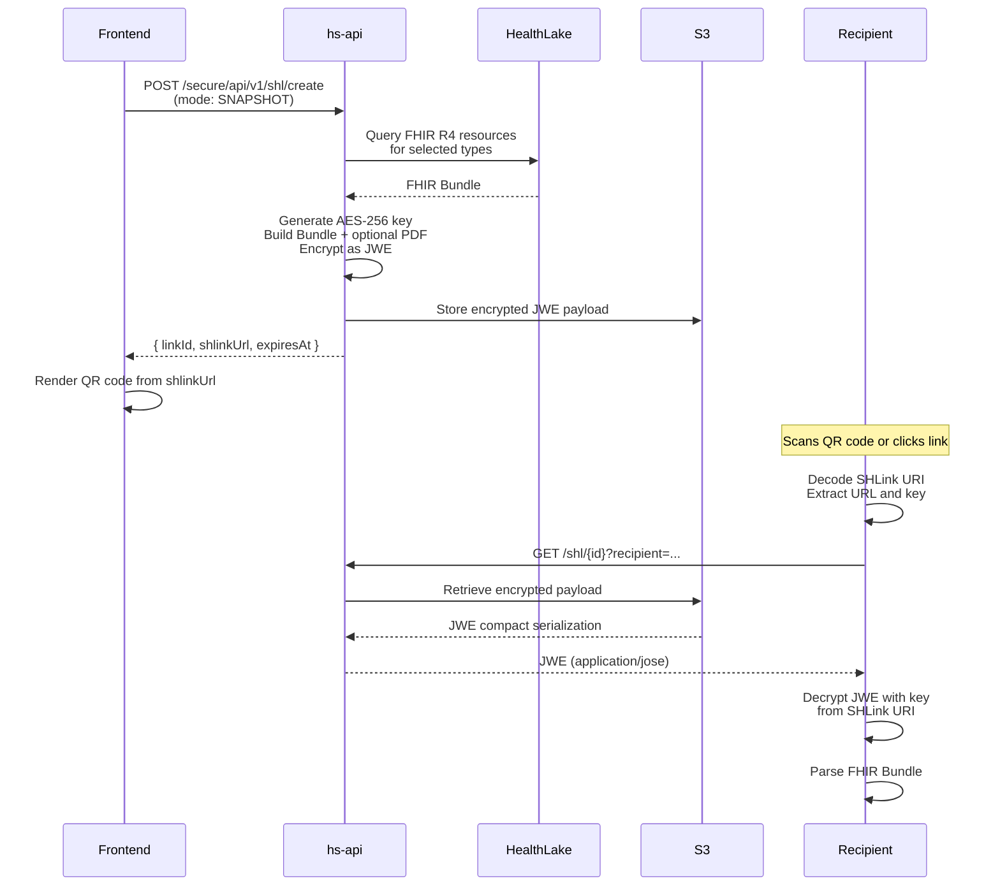
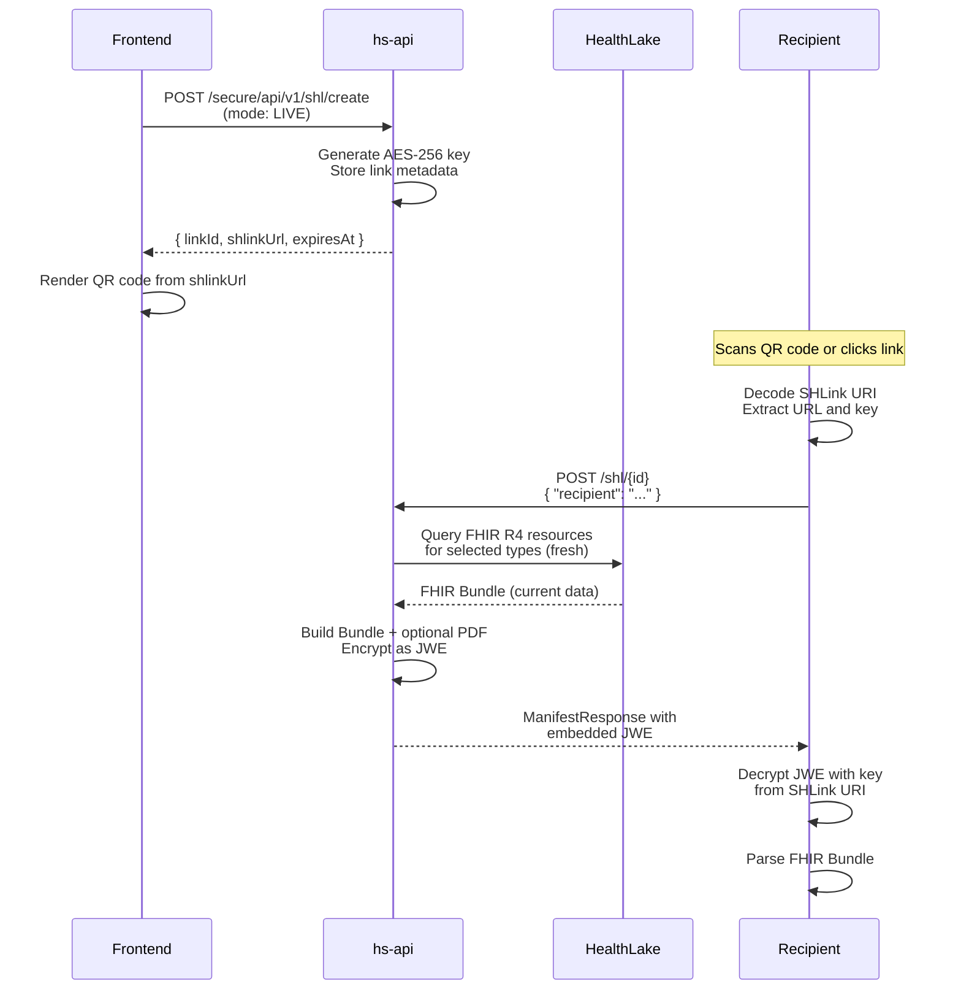

# hs-api Consumer Guide

This document is the complete reference for integrating with the hs-api service.
It covers authentication, the GraphQL API, the SHL (SMART Health Links) REST API,
encryption details, and end-to-end usage flows. No access to source code is
required to use this guide.

---

## Table of Contents

1. [Overview](#1-overview)
2. [Authentication](#2-authentication)
3. [Common Patterns](#3-common-patterns)
4. [GraphQL API](#4-graphql-api)
5. [GraphQL Type Reference](#5-graphql-type-reference)
6. [SHL Secured REST API](#6-shl-secured-rest-api)
7. [SHL Public API](#7-shl-public-api)
8. [End-to-End Flows](#8-end-to-end-flows)
9. [SHLink URI Format](#9-shlink-uri-format)
10. [JWE Decryption](#10-jwe-decryption)
11. [FHIR Resource Type Mapping](#11-fhir-resource-type-mapping)
12. [Status Values and Lifecycle](#12-status-values-and-lifecycle)
13. [Error Handling](#13-error-handling)
14. [Rate Limiting](#14-rate-limiting)
15. [Quick-Start Checklists](#15-quick-start-checklists)

---

## 1. Overview

hs-api exposes two API surfaces:

| Surface | Transport | Base Path | Auth Required |
|---------|-----------|-----------|---------------|
| **GraphQL API** | POST with JSON body | `/graphql` | Yes |
| **SHL Secured REST API** | POST with JSON body | `/secure/api/v1/shl/` | Yes |
| **SHL Public API** | GET / POST / OPTIONS | `/shl/{id}` | No |

The GraphQL API provides 13 queries for retrieving patient health data sourced
from FHIR R4 resources. The SHL API implements the
[HL7 SMART Health Links](https://docs.smarthealthit.org/smart-health-links/)
specification, allowing patients to share encrypted health records via scannable
links.

---

## 2. Authentication

### Secured endpoints

All secured endpoints (GraphQL and SHL management) require the `X-Consumer-Id`
HTTP header. This header is normally injected by an upstream OAuth2 proxy after
the user has been authenticated. The value identifies the consuming application
or user context.

| Header | Required | Description |
|--------|----------|-------------|
| `X-Consumer-Id` | **Yes** | Identifies the authenticated consumer. Provided by your OAuth2 proxy. |
| `X-Request-Id` | No | Optional correlation ID. If supplied, the value is echoed in responses and included in server logs for tracing. |

**Missing `X-Consumer-Id` response:**

```http
HTTP/1.1 401 Unauthorized
Content-Type: application/json

{
  "error": "unauthorized",
  "message": "X-Consumer-Id header is required",
  "timestamp": "2026-03-06T14:30:00Z",
  "path": "/graphql"
}
```

### Public endpoints

The public SHL endpoints under `/shl/{id}` require **no authentication**. These
are designed to be accessible by any recipient who possesses the SHLink URI
(typically obtained by scanning a QR code or clicking a shared link).

---

## 3. Common Patterns

### Request conventions

- **Content-Type**: All requests must use `application/json`.
- **HTTP method**: All secured SHL endpoints use `POST` exclusively. No resource
  IDs appear in URLs for secured endpoints; identifiers are passed in the
  request body.
- **Base path**: Secured SHL endpoints are rooted at `/secure/api/v1/shl/`.
- **GraphQL endpoint**: A single endpoint at `POST /graphql` serves all queries.

### Standard error response format

Every error response follows a consistent JSON structure:

```json
{
  "error": "string",
  "message": "string",
  "timestamp": "2026-03-06T14:30:00Z",
  "path": "/secure/api/v1/shl/get"
}
```

### HTTP status codes

| Code | Meaning | When Returned |
|------|---------|---------------|
| `200` | Success | Successful retrieval or operation |
| `201` | Created | Resource successfully created (e.g., new SHL link) |
| `204` | No Content | Successful operation with no response body (e.g., revoke) |
| `400` | Bad Request | Malformed JSON, missing required fields, or invalid parameters |
| `401` | Unauthorized | Missing or invalid `X-Consumer-Id` header |
| `404` | Not Found | Requested resource does not exist, is expired, or is revoked |
| `500` | Server Error | Unexpected internal error |

---

## 4. GraphQL API

### Endpoint

```
POST /graphql
```

### Required headers

```
Content-Type: application/json
X-Consumer-Id: {your-consumer-id}
```

### Request format

All GraphQL requests use the standard POST body format:

```json
{
  "query": "{ ... }",
  "variables": { ... },
  "operationName": "OptionalName"
}
```

### Quick example

```bash
curl -X POST http://localhost:8080/graphql \
  -H "Content-Type: application/json" \
  -H "X-Consumer-Id: test-consumer" \
  -d '{"query":"{ medications(enterpriseId: \"patient-123\") { name status dosage } }"}'
```

**Response:**

```json
{
  "data": {
    "medications": [
      {
        "name": "Lisinopril 10mg Tablet",
        "status": "active",
        "dosage": "10mg once daily"
      },
      {
        "name": "Metformin 500mg Tablet",
        "status": "active",
        "dosage": "500mg twice daily"
      }
    ]
  }
}
```

### Common query parameters

Most queries share these parameters:

| Parameter | Type | Required | Description |
|-----------|------|----------|-------------|
| `enterpriseId` | `String!` | **Yes** | The patient's enterprise identifier. |
| `startDate` | `String` | No | ISO-8601 date string. Filters results to on or after this date. |
| `endDate` | `String` | No | ISO-8601 date string. Filters results to on or before this date. |
| `sortOrder` | `SortOrder` | No | `ASC` or `DESC`. Controls chronological ordering of results. |

### SortOrder enum

```graphql
enum SortOrder {
  ASC
  DESC
}
```

---

### All 13 queries

#### 1. patientSummary

Returns core demographics for a patient.

```graphql
query {
  patientSummary(enterpriseId: "patient-123") {
    id
    firstName
    lastName
    birthDate
    gender
    address
    phone
    email
  }
}
```

#### 2. medications

Returns current and historical medication records.

```graphql
query {
  medications(
    enterpriseId: "patient-123"
    startDate: "2025-01-01"
    endDate: "2026-03-06"
    sortOrder: DESC
  ) {
    id
    name
    status
    dosage
    reason
    startDate
    endDate
  }
}
```

#### 3. immunizations

Returns vaccination records.

```graphql
query {
  immunizations(
    enterpriseId: "patient-123"
    startDate: "2020-01-01"
    sortOrder: ASC
  ) {
    id
    name
    status
    date
    site
    performer
  }
}
```

#### 4. allergies

Returns allergy and intolerance records.

```graphql
query {
  allergies(
    enterpriseId: "patient-123"
    sortOrder: DESC
  ) {
    id
    substance
    category
    criticality
    status
    recordedDate
    reaction
  }
}
```

#### 5. conditions

Returns diagnoses and health conditions.

```graphql
query {
  conditions(
    enterpriseId: "patient-123"
    startDate: "2024-01-01"
    sortOrder: DESC
  ) {
    id
    name
    status
    category
    onsetDate
    abatementDate
  }
}
```

#### 6. procedures

Returns clinical procedures performed on the patient.

```graphql
query {
  procedures(
    enterpriseId: "patient-123"
    sortOrder: DESC
  ) {
    id
    name
    status
    performedDate
    performer
    location
  }
}
```

#### 7. labResults

Returns laboratory observations and test results.

```graphql
query {
  labResults(
    enterpriseId: "patient-123"
    startDate: "2025-06-01"
    sortOrder: DESC
  ) {
    id
    name
    value
    unit
    status
    effectiveDate
    referenceRange
    interpretation
  }
}
```

#### 8. coverages

Returns insurance coverage records.

```graphql
query {
  coverages(
    enterpriseId: "patient-123"
    sortOrder: DESC
  ) {
    id
    type
    status
    payor
    subscriberId
    startDate
    endDate
  }
}
```

#### 9. claims

Returns claims and explanation of benefits.

```graphql
query {
  claims(
    enterpriseId: "patient-123"
    startDate: "2025-01-01"
    sortOrder: DESC
  ) {
    id
    type
    status
    provider
    serviceDate
    totalAmount
    currency
  }
}
```

#### 10. appointments

Returns scheduled and past appointments.

```graphql
query {
  appointments(
    enterpriseId: "patient-123"
    sortOrder: ASC
  ) {
    id
    status
    type
    description
    date
    participant
    location
  }
}
```

#### 11. careTeams

Returns care team compositions.

```graphql
query {
  careTeams(
    enterpriseId: "patient-123"
    sortOrder: DESC
  ) {
    id
    name
    status
    category
    participants
    startDate
  }
}
```

#### 12. resourceCounts

Returns a count of each resource type available for the patient. Does not
accept date filters or sort order.

```graphql
query {
  resourceCounts(enterpriseId: "patient-123") {
    medications
    immunizations
    allergies
    conditions
    procedures
    labResults
    coverages
    claims
    appointments
    careTeams
    total
  }
}
```

#### 13. healthDashboard

Returns a combined view of resource counts and patient demographics in a
single query. Does not accept date filters or sort order.

```graphql
query {
  healthDashboard(enterpriseId: "patient-123") {
    resourceCounts {
      medications
      immunizations
      allergies
      conditions
      procedures
      labResults
      coverages
      claims
      appointments
      careTeams
      total
    }
    patientSummary {
      id
      firstName
      lastName
      birthDate
      gender
      address
      phone
      email
    }
  }
}
```

### Combining multiple queries

GraphQL allows fetching multiple resources in a single request:

```graphql
query PatientOverview {
  patientSummary(enterpriseId: "patient-123") {
    firstName
    lastName
    birthDate
  }
  medications(enterpriseId: "patient-123", sortOrder: DESC) {
    name
    status
    dosage
  }
  allergies(enterpriseId: "patient-123") {
    substance
    criticality
  }
  conditions(enterpriseId: "patient-123", sortOrder: DESC) {
    name
    status
    onsetDate
  }
}
```

### Using variables

Variables keep queries reusable and avoid string interpolation issues:

```bash
curl -X POST http://localhost:8080/graphql \
  -H "Content-Type: application/json" \
  -H "X-Consumer-Id: test-consumer" \
  -d '{
    "query": "query GetMeds($eid: String!, $sort: SortOrder) { medications(enterpriseId: $eid, sortOrder: $sort) { name status dosage } }",
    "variables": {
      "eid": "patient-123",
      "sort": "DESC"
    }
  }'
```

---

## 5. GraphQL Type Reference

### PatientSummary

| Field | Type | Description |
|-------|------|-------------|
| `id` | `String!` | Patient resource identifier |
| `firstName` | `String` | Patient's given name |
| `lastName` | `String` | Patient's family name |
| `birthDate` | `String` | Date of birth (ISO-8601 date) |
| `gender` | `String` | Administrative gender |
| `address` | `String` | Formatted address string |
| `phone` | `String` | Primary phone number |
| `email` | `String` | Primary email address |

### Medication

| Field | Type | Description |
|-------|------|-------------|
| `id` | `String!` | Medication request identifier |
| `name` | `String` | Medication name and strength |
| `status` | `String` | Status: active, completed, stopped, etc. |
| `dosage` | `String` | Dosage instructions |
| `reason` | `String` | Reason for the medication |
| `startDate` | `String` | Date medication was started |
| `endDate` | `String` | Date medication was ended (if applicable) |

### Immunization

| Field | Type | Description |
|-------|------|-------------|
| `id` | `String!` | Immunization record identifier |
| `name` | `String` | Vaccine name |
| `status` | `String` | Status: completed, entered-in-error, not-done |
| `date` | `String` | Date the immunization was administered |
| `site` | `String` | Body site of administration |
| `performer` | `String` | Name of the administering provider |

### Allergy

| Field | Type | Description |
|-------|------|-------------|
| `id` | `String!` | Allergy record identifier |
| `substance` | `String` | Allergenic substance |
| `category` | `String` | Category: food, medication, environment, biologic |
| `criticality` | `String` | Criticality: low, high, unable-to-assess |
| `status` | `String` | Clinical status: active, inactive, resolved |
| `recordedDate` | `String` | Date the allergy was recorded |
| `reaction` | `String` | Description of the allergic reaction |

### Condition

| Field | Type | Description |
|-------|------|-------------|
| `id` | `String!` | Condition record identifier |
| `name` | `String` | Condition or diagnosis name |
| `status` | `String` | Clinical status: active, recurrence, relapse, inactive, remission, resolved |
| `category` | `String` | Category: problem-list-item, encounter-diagnosis |
| `onsetDate` | `String` | Date the condition began |
| `abatementDate` | `String` | Date the condition resolved (if applicable) |

### Procedure

| Field | Type | Description |
|-------|------|-------------|
| `id` | `String!` | Procedure record identifier |
| `name` | `String` | Procedure name |
| `status` | `String` | Status: completed, in-progress, not-done, etc. |
| `performedDate` | `String` | Date the procedure was performed |
| `performer` | `String` | Name of the performing provider |
| `location` | `String` | Facility where the procedure was performed |

### LabResult

| Field | Type | Description |
|-------|------|-------------|
| `id` | `String!` | Observation identifier |
| `name` | `String` | Lab test name |
| `value` | `String` | Result value |
| `unit` | `String` | Unit of measurement |
| `status` | `String` | Status: final, preliminary, amended, etc. |
| `effectiveDate` | `String` | Date the specimen was collected or observation was made |
| `referenceRange` | `String` | Normal reference range |
| `interpretation` | `String` | Interpretation: normal, high, low, critical, etc. |

### Coverage

| Field | Type | Description |
|-------|------|-------------|
| `id` | `String!` | Coverage record identifier |
| `type` | `String` | Coverage type (e.g., medical, dental, vision) |
| `status` | `String` | Status: active, cancelled, entered-in-error |
| `payor` | `String` | Insurance company or payor name |
| `subscriberId` | `String` | Subscriber/member identifier |
| `startDate` | `String` | Coverage start date |
| `endDate` | `String` | Coverage end date |

### Claim

| Field | Type | Description |
|-------|------|-------------|
| `id` | `String!` | Claim/EOB identifier |
| `type` | `String` | Claim type (e.g., professional, institutional, pharmacy) |
| `status` | `String` | Status: active, cancelled, entered-in-error |
| `provider` | `String` | Provider name |
| `serviceDate` | `String` | Date of service |
| `totalAmount` | `String` | Total claim amount |
| `currency` | `String` | Currency code (e.g., USD) |

### Appointment

| Field | Type | Description |
|-------|------|-------------|
| `id` | `String!` | Appointment identifier |
| `status` | `String` | Status: proposed, pending, booked, fulfilled, cancelled, etc. |
| `type` | `String` | Appointment type |
| `description` | `String` | Description or reason for the appointment |
| `date` | `String` | Scheduled date and time |
| `participant` | `String` | Participating provider(s) |
| `location` | `String` | Facility or location |

### CareTeam

| Field | Type | Description |
|-------|------|-------------|
| `id` | `String!` | Care team identifier |
| `name` | `String` | Care team name |
| `status` | `String` | Status: proposed, active, suspended, inactive |
| `category` | `String` | Category of care team |
| `participants` | `[String]` | Team members |
| `startDate` | `String` | Date the care team was established |

### ResourceCounts

| Field | Type | Description |
|-------|------|-------------|
| `medications` | `Int!` | Number of medication records |
| `immunizations` | `Int!` | Number of immunization records |
| `allergies` | `Int!` | Number of allergy records |
| `conditions` | `Int!` | Number of condition records |
| `procedures` | `Int!` | Number of procedure records |
| `labResults` | `Int!` | Number of lab result records |
| `coverages` | `Int!` | Number of coverage records |
| `claims` | `Int!` | Number of claim records |
| `appointments` | `Int!` | Number of appointment records |
| `careTeams` | `Int!` | Number of care team records |
| `total` | `Int!` | Sum of all resource counts |

### HealthDashboard

| Field | Type | Description |
|-------|------|-------------|
| `resourceCounts` | `ResourceCounts!` | Aggregate counts for all resource types |
| `patientSummary` | `PatientSummary` | Patient demographics |

---

## 6. SHL Secured REST API

All secured SHL endpoints follow the same conventions:

- **Method**: `POST`
- **Base path**: `/secure/api/v1/shl/`
- **Required header**: `X-Consumer-Id`
- **Content-Type**: `application/json`
- **ID convention**: Patient identifiers and link IDs are passed in the request body, never in the URL path.

---

### Search links

Retrieve all SHL links for a given patient.

**Endpoint**: `POST /secure/api/v1/shl/search`

**Request:**

```json
{
  "idType": "ENTERPRISE_ID",
  "idValue": "patient-123"
}
```

**Response** (200 OK):

```json
[
  {
    "linkId": "abc123",
    "label": "My Health Summary",
    "mode": "SNAPSHOT",
    "flag": "U",
    "effectiveStatus": "active",
    "shlinkUrl": "shlink:/eyJ...",
    "expiresAt": "2026-04-01T00:00:00Z",
    "createdAt": "2026-03-06T00:00:00Z",
    "selectedResources": ["Patient", "Condition", "MedicationRequest"],
    "includePdf": true,
    "accessHistory": []
  }
]
```

**curl example:**

```bash
curl -X POST http://localhost:8080/secure/api/v1/shl/search \
  -H "Content-Type: application/json" \
  -H "X-Consumer-Id: test-consumer" \
  -d '{"idType":"ENTERPRISE_ID","idValue":"patient-123"}'
```

---

### Get link details

Retrieve a specific SHL link with its full access history.

**Endpoint**: `POST /secure/api/v1/shl/get`

**Request:**

```json
{
  "idType": "ENTERPRISE_ID",
  "idValue": "patient-123",
  "linkId": "abc123"
}
```

**Response** (200 OK):

```json
{
  "linkId": "abc123",
  "label": "My Health Summary",
  "mode": "SNAPSHOT",
  "flag": "U",
  "effectiveStatus": "active",
  "shlinkUrl": "shlink:/eyJ...",
  "expiresAt": "2026-04-01T00:00:00Z",
  "createdAt": "2026-03-06T00:00:00Z",
  "selectedResources": ["Patient", "Condition", "MedicationRequest"],
  "includePdf": true,
  "accessHistory": [
    {
      "recipient": "dr.smith@hospital.org",
      "action": "ACCESSED",
      "timestamp": "2026-03-06T12:00:00Z"
    }
  ]
}
```

**curl example:**

```bash
curl -X POST http://localhost:8080/secure/api/v1/shl/get \
  -H "Content-Type: application/json" \
  -H "X-Consumer-Id: test-consumer" \
  -d '{"idType":"ENTERPRISE_ID","idValue":"patient-123","linkId":"abc123"}'
```

---

### Preview link content

Retrieve the decrypted FHIR Bundle for a given SHL link. This is intended for
the link owner to preview what recipients will see.

**Endpoint**: `POST /secure/api/v1/shl/preview`

**Request:**

```json
{
  "idType": "ENTERPRISE_ID",
  "idValue": "patient-123",
  "linkId": "abc123"
}
```

**Response** (200 OK):

The response body is a raw FHIR R4 Bundle in JSON format:

```json
{
  "resourceType": "Bundle",
  "type": "collection",
  "entry": [
    {
      "resource": {
        "resourceType": "Patient",
        "id": "patient-123",
        "name": [{ "family": "Doe", "given": ["John"] }]
      }
    },
    {
      "resource": {
        "resourceType": "Condition",
        "id": "cond-456",
        "code": {
          "coding": [{ "system": "http://snomed.info/sct", "code": "44054006", "display": "Diabetes mellitus type 2" }]
        }
      }
    }
  ]
}
```

**curl example:**

```bash
curl -X POST http://localhost:8080/secure/api/v1/shl/preview \
  -H "Content-Type: application/json" \
  -H "X-Consumer-Id: test-consumer" \
  -d '{"idType":"ENTERPRISE_ID","idValue":"patient-123","linkId":"abc123"}'
```

---

### Create link

Create a new SHL link for sharing patient health data.

**Endpoint**: `POST /secure/api/v1/shl/create`

**Request:**

```json
{
  "idType": "ENTERPRISE_ID",
  "idValue": "patient-123",
  "label": "My Health Summary",
  "expiresAt": "2026-04-01T00:00:00Z",
  "selectedResources": ["Patient", "Condition", "MedicationRequest"],
  "includePdf": true,
  "patientName": "John Doe",
  "mode": "SNAPSHOT"
}
```

| Field | Type | Required | Description |
|-------|------|----------|-------------|
| `idType` | String | Yes | Identifier type. Use `ENTERPRISE_ID`. |
| `idValue` | String | Yes | Patient identifier value. |
| `label` | String | Yes | Human-readable label for the link. |
| `expiresAt` | String | Yes | ISO-8601 expiration timestamp. |
| `selectedResources` | String[] | Yes | FHIR R4 resource types to include. See [FHIR Resource Type Mapping](#11-fhir-resource-type-mapping). |
| `includePdf` | Boolean | No | Whether to include a PDF rendering of the health summary. Defaults to `false`. |
| `patientName` | String | No | Patient display name for the PDF cover page. Required if `includePdf` is `true`. |
| `mode` | String | Yes | `SNAPSHOT` (data captured at creation time) or `LIVE` (data fetched fresh on each access). |

**Response** (200 OK):

```json
{
  "linkId": "abc123",
  "shlinkUrl": "shlink:/eyJ...",
  "expiresAt": "2026-04-01T00:00:00Z"
}
```

**curl example:**

```bash
curl -X POST http://localhost:8080/secure/api/v1/shl/create \
  -H "Content-Type: application/json" \
  -H "X-Consumer-Id: test-consumer" \
  -d '{
    "idType": "ENTERPRISE_ID",
    "idValue": "patient-123",
    "label": "My Health Summary",
    "expiresAt": "2026-04-01T00:00:00Z",
    "selectedResources": ["Patient", "Condition", "MedicationRequest"],
    "includePdf": true,
    "patientName": "John Doe",
    "mode": "SNAPSHOT"
  }'
```

---

### Revoke link

Permanently revoke an active SHL link. Once revoked, the link cannot be
reactivated. Any subsequent public access attempts will fail.

**Endpoint**: `POST /secure/api/v1/shl/revoke`

**Request:**

```json
{
  "idType": "ENTERPRISE_ID",
  "idValue": "patient-123",
  "linkId": "abc123"
}
```

**Response**: `200 OK` (empty body)

**curl example:**

```bash
curl -X POST http://localhost:8080/secure/api/v1/shl/revoke \
  -H "Content-Type: application/json" \
  -H "X-Consumer-Id: test-consumer" \
  -d '{"idType":"ENTERPRISE_ID","idValue":"patient-123","linkId":"abc123"}'
```

---

### ShlLinkResponse schema

All SHL secured endpoints that return link data use this structure:

```json
{
  "linkId": "abc123",
  "label": "My Health Summary",
  "mode": "snapshot",
  "flag": "U",
  "effectiveStatus": "active",
  "shlinkUrl": "shlink:/eyJ...",
  "expiresAt": "2026-04-01T00:00:00Z",
  "createdAt": "2026-03-06T00:00:00Z",
  "selectedResources": ["Patient", "Condition", "MedicationRequest"],
  "includePdf": true,
  "accessHistory": [
    {
      "recipient": "dr.smith@hospital.org",
      "action": "ACCESSED",
      "timestamp": "2026-03-06T12:00:00Z"
    }
  ]
}
```

| Field | Type | Description |
|-------|------|-------------|
| `linkId` | String | Unique identifier for the SHL link |
| `label` | String | Human-readable label |
| `mode` | String | `snapshot` or `live` |
| `flag` | String | SHL spec flag: `U` (snapshot/unlocked) or `L` (live/manifest) |
| `effectiveStatus` | String | `active`, `expired`, or `revoked` |
| `shlinkUrl` | String | Full SHLink URI for sharing |
| `expiresAt` | String | ISO-8601 expiration timestamp |
| `createdAt` | String | ISO-8601 creation timestamp |
| `selectedResources` | String[] | FHIR R4 resource types included in this link |
| `includePdf` | Boolean | Whether a PDF rendering is included |
| `accessHistory` | Object[] | Array of access log entries (may be empty on search) |
| `accessHistory[].recipient` | String | Identifier of the recipient who accessed the link |
| `accessHistory[].action` | String | Access action (e.g., `ACCESSED`) |
| `accessHistory[].timestamp` | String | ISO-8601 timestamp of the access |

---

## 7. SHL Public API

These endpoints are used by recipients who have received a SHLink (e.g., by
scanning a QR code). No authentication is required.

---

### GET /shl/{id} -- Snapshot retrieval

Used for links with flag `U` (snapshot mode). Returns the encrypted health data
as a JWE compact serialization string.

**Request:**

```
GET /shl/{id}?recipient={recipient}
```

| Parameter | In | Required | Description |
|-----------|----|----------|-------------|
| `id` | Path | Yes | The link identifier (from the SHLink URI `url` field). |
| `recipient` | Query | No | Identifier of the person accessing the link (e.g., email address). Recorded in access history. |

**Response** (200 OK):

```
Content-Type: application/jose

eyJhbGciOiJkaXIiLCJlbmMiOiJBMjU2R0NNIiwiemlwIjoiREVGIn0..iv.ciphertext.tag
```

The response body is a JWE compact serialization string. See
[JWE Decryption](#10-jwe-decryption) for how to decrypt it.

**Error responses:**

| Status | Condition |
|--------|-----------|
| `400` | Link uses `L` flag (live mode). Must use POST instead. |
| `404` | Link not found, expired, or revoked. |

**curl example:**

```bash
curl http://localhost:8080/shl/abc123?recipient=dr.smith@hospital.org
```

---

### POST /shl/{id} -- Manifest retrieval

Used for links with flag `L` (live mode). The server fetches fresh data from
the health data store, encrypts it, and returns a manifest response.

**Request:**

```
POST /shl/{id}
Content-Type: application/json

{
  "recipient": "dr.smith@hospital.org"
}
```

| Field | Type | Required | Description |
|-------|------|----------|-------------|
| `recipient` | String | No | Identifier of the person accessing the link. Recorded in access history. |

**Response** (200 OK):

```json
{
  "status": "can-change",
  "files": [
    {
      "contentType": "application/fhir+json",
      "embedded": "eyJhbGciOiJkaXIi..."
    }
  ]
}
```

| Field | Type | Description |
|-------|------|-------------|
| `status` | String | `can-change` (link is active, data may be updated on future access) or `no-longer-valid` (link is expired or revoked). |
| `files` | Object[] | Array of file entries. |
| `files[].contentType` | String | MIME type of the embedded content. Always `application/fhir+json`. |
| `files[].embedded` | String | JWE compact serialization of the encrypted FHIR Bundle. |

The `embedded` value is a JWE string. Decrypt it using the key from the SHLink
URI. See [JWE Decryption](#10-jwe-decryption).

**Error responses:**

| Status | Condition |
|--------|-----------|
| `404` | Link not found, expired, or revoked. |

**curl example:**

```bash
curl -X POST http://localhost:8080/shl/abc123 \
  -H "Content-Type: application/json" \
  -d '{"recipient":"dr.smith@hospital.org"}'
```

---

### OPTIONS /shl/{id} -- CORS preflight

Standard CORS preflight handling. All origins are allowed.

```
OPTIONS /shl/{id}

Access-Control-Allow-Origin: *
Access-Control-Allow-Methods: GET, POST, OPTIONS
Access-Control-Allow-Headers: Content-Type
```

---

## 8. End-to-End Flows

### Snapshot flow

In snapshot mode, the health data is captured and encrypted at link creation
time. Recipients retrieve a pre-built, static package.



### Live flow

In live mode, the health data is fetched fresh from the data store on every
access. The recipient always sees the most current information.



---

## 9. SHLink URI Format

A SHLink URI encodes all the information a recipient needs to retrieve and
decrypt shared health data.

### Structure

```
shlink:/{base64url-encoded-json}
```

The payload after `shlink:/` is a Base64URL-encoded (no padding) JSON object.

### Decoded JSON structure

```json
{
  "url": "https://api.example.com/shl/abc123",
  "flag": "U",
  "key": "base64url-encoded-aes-256-key",
  "exp": 1743465600,
  "label": "Patient Health Summary"
}
```

| Field | Type | Description |
|-------|------|-------------|
| `url` | String | Full URL to the public SHL endpoint for this link. |
| `flag` | String | `U` for snapshot (use GET) or `L` for live (use POST). |
| `key` | String | Base64URL-encoded AES-256 key (32 bytes, no padding). Used to decrypt the JWE response. |
| `exp` | Number | Expiration time as Unix epoch seconds. |
| `label` | String | Human-readable label for display purposes. |

### Python decoding example

```python
import base64
import json

shlink_uri = "shlink:/eyJ1cmwiOiJodHRwczovL2FwaS5leGFtcGxlLmNvbS9zaGwvYWJjMTIzIiwiZmxhZyI6IlUiLCJrZXkiOiJhYmNkZWYxMjM0NTYiLCJleHAiOjE3NDM0NjU2MDAsImxhYmVsIjoiUGF0aWVudCBIZWFsdGggU3VtbWFyeSJ9"

# Remove the "shlink:/" prefix
encoded_payload = shlink_uri.replace("shlink:/", "")

# Add padding if necessary and decode
padded = encoded_payload + "=" * (4 - len(encoded_payload) % 4)
decoded_bytes = base64.urlsafe_b64decode(padded)
shlink_data = json.loads(decoded_bytes)

print(f"URL:   {shlink_data['url']}")
print(f"Flag:  {shlink_data['flag']}")
print(f"Key:   {shlink_data['key']}")
print(f"Exp:   {shlink_data['exp']}")
print(f"Label: {shlink_data['label']}")
```

### Java decoding example

```java
import java.util.Base64;

// Assume: String shlinkUri = "shlink:/eyJ...";
String encodedPayload = shlinkUri.substring("shlink:/".length());
byte[] decodedBytes = Base64.getUrlDecoder().decode(encodedPayload);
String json = new String(decodedBytes, java.nio.charset.StandardCharsets.UTF_8);

// Parse with your preferred JSON library (Jackson, Gson, etc.)
// Example with Gson:
// JsonObject shlink = JsonParser.parseString(json).getAsJsonObject();
// String url = shlink.get("url").getAsString();
// String flag = shlink.get("flag").getAsString();
// String key = shlink.get("key").getAsString();
// long exp = shlink.get("exp").getAsLong();
// String label = shlink.get("label").getAsString();

System.out.println("Decoded SHLink JSON: " + json);
```

---

## 10. JWE Decryption

The encrypted health data returned by the public SHL endpoints uses JWE
(JSON Web Encryption) compact serialization.

### Encryption parameters

| Parameter | Value | Description |
|-----------|-------|-------------|
| Algorithm (`alg`) | `dir` | Direct key agreement (no key wrapping) |
| Encryption (`enc`) | `A256GCM` | AES-256 in GCM mode |
| Compression (`zip`) | `DEF` | DEFLATE compression applied before encryption |
| Content type (`cty`) | `application/fhir+json` | The decrypted payload is a FHIR R4 Bundle in JSON |

### JWE compact serialization format

```
header.encryptedKey.iv.ciphertext.tag
```

- **header**: Base64URL-encoded JWE protected header (`{"alg":"dir","enc":"A256GCM","zip":"DEF"}`)
- **encryptedKey**: Empty (the `dir` algorithm uses the key directly, no wrapping)
- **iv**: Base64URL-encoded initialization vector
- **ciphertext**: Base64URL-encoded encrypted content
- **tag**: Base64URL-encoded authentication tag

### Key source

The decryption key is the 32-byte AES-256 key from the `key` field of the
decoded SHLink URI. The key is Base64URL-encoded without padding in the SHLink.

### Python decryption example

```python
from jwcrypto import jwe, jwk
import base64

# The key from the decoded SHLink URI
shlink_key = "base64url-encoded-aes-key-from-shlink"

# The JWE compact serialization string from the API response
jwe_compact_string = "eyJhbGciOiJkaXIi..."

# Decode the raw key bytes (add padding for base64)
raw_key = base64.urlsafe_b64decode(shlink_key + "==")

# Create a JWK from the raw key bytes
key = jwk.JWK(
    kty="oct",
    k=base64.urlsafe_b64encode(raw_key).decode().rstrip("=")
)

# Decrypt the JWE
jwe_obj = jwe.JWE()
jwe_obj.deserialize(jwe_compact_string)
jwe_obj.decrypt(key)

# The decrypted payload is a FHIR R4 Bundle JSON string
fhir_bundle = jwe_obj.payload.decode()
print(fhir_bundle)
```

**Install dependency**: `pip install jwcrypto`

### Java decryption example

```java
import com.nimbusds.jose.JWEObject;
import com.nimbusds.jose.crypto.DirectDecrypter;
import javax.crypto.spec.SecretKeySpec;
import java.util.Base64;

// The key from the decoded SHLink URI
String shlinkKey = "base64url-encoded-aes-key-from-shlink";

// The JWE compact serialization string from the API response
String jweCompactString = "eyJhbGciOiJkaXIi...";

// Decode the raw AES key
byte[] rawKey = Base64.getUrlDecoder().decode(shlinkKey);
SecretKeySpec aesKey = new SecretKeySpec(rawKey, "AES");

// Parse and decrypt the JWE
JWEObject jweObject = JWEObject.parse(jweCompactString);
jweObject.decrypt(new DirectDecrypter(aesKey));

// The decrypted payload is a FHIR R4 Bundle JSON string
String fhirBundle = jweObject.getPayload().toString();
System.out.println(fhirBundle);
```

**Maven dependency:**

```xml
<dependency>
    <groupId>com.nimbusds</groupId>
    <artifactId>nimbus-jose-jwt</artifactId>
    <version>10.2</version>
</dependency>
```

---

## 11. FHIR Resource Type Mapping

This table maps between the GraphQL queries, the underlying FHIR R4 resource
types, and the values to use in the `selectedResources` array when creating
SHL links.

| GraphQL Query | FHIR R4 Resource | `selectedResources` Value |
|---------------|------------------|---------------------------|
| `patientSummary` | Patient | `Patient` |
| `medications` | MedicationRequest | `MedicationRequest` |
| `immunizations` | Immunization | `Immunization` |
| `allergies` | AllergyIntolerance | `AllergyIntolerance` |
| `conditions` | Condition | `Condition` |
| `procedures` | Procedure | `Procedure` |
| `labResults` | Observation | `Observation` |
| `coverages` | Coverage | `Coverage` |
| `claims` | ExplanationOfBenefit | `ExplanationOfBenefit` |
| `appointments` | Appointment | `Appointment` |
| `careTeams` | CareTeam | `CareTeam` |

When creating a SHL link, the `selectedResources` array accepts any combination
of these FHIR R4 resource type names. Only the specified resource types will be
included in the shared health data bundle.

**Example**: To share a patient's demographics, active conditions, and current
medications:

```json
{
  "selectedResources": ["Patient", "Condition", "MedicationRequest"]
}
```

---

## 12. Status Values and Lifecycle

### Effective status values

| Status | Meaning |
|--------|---------|
| `active` | The link is usable. Recipients can access the shared data. |
| `expired` | The link has passed its `expiresAt` timestamp. Access attempts are rejected. |
| `revoked` | The link was explicitly revoked via the `/revoke` endpoint. Access attempts are rejected. |

### Lifecycle diagram

```
                  +---------+
                  |         |
    POST /create  |  active |
    ----------->  |         |
                  +----+----+
                       |
          +------------+------------+
          |                         |
          v                         v
    +-----------+            +-----------+
    |           |            |           |
    |  expired  |            |  revoked  |
    |           |            |           |
    +-----------+            +-----------+
    (automatic,              (explicit,
     time-based)              via /revoke)
```

### Key behaviors

- **Expiration is automatic.** When the current time passes the `expiresAt`
  timestamp, the `effectiveStatus` transitions to `expired` without any API
  call. The underlying record is unchanged; the status is computed at read time.
- **Revocation is permanent.** Once revoked, a link cannot be reactivated. A new
  link must be created if sharing is needed again.
- **Public access to non-active links.** Attempts to access an expired or revoked
  link via the public endpoints (`/shl/{id}`) return a `404 Not Found` response.
- **Search includes all statuses.** The `/search` endpoint returns links in all
  statuses (active, expired, revoked) so the link owner can see the complete
  history.

---

## 13. Error Handling

### GraphQL errors

GraphQL errors follow the standard GraphQL error response format:

```json
{
  "errors": [
    {
      "message": "Patient not found for enterpriseId: invalid-id",
      "locations": [{ "line": 1, "column": 3 }],
      "path": ["patientSummary"],
      "extensions": {
        "classification": "NOT_FOUND"
      }
    }
  ],
  "data": {
    "patientSummary": null
  }
}
```

Note that GraphQL always returns HTTP 200, even when there are errors. Always
check the `errors` array in the response body.

### REST API errors

REST endpoints return appropriate HTTP status codes with a JSON error body:

```json
{
  "error": "not_found",
  "message": "SHL link not found: abc123",
  "timestamp": "2026-03-06T14:30:00Z",
  "path": "/secure/api/v1/shl/get"
}
```

### Common error scenarios

| Scenario | GraphQL Response | REST Response |
|----------|-----------------|---------------|
| Missing `X-Consumer-Id` | HTTP 401 with JSON error body | HTTP 401 with JSON error body |
| Invalid `enterpriseId` | 200 with `errors` array | N/A |
| Patient not found | 200 with `errors` array, null data | N/A |
| Link not found | N/A | HTTP 404 |
| Link expired/revoked (public endpoint) | N/A | HTTP 404 |
| Snapshot link accessed via POST | N/A | HTTP 400 |
| Live link accessed via GET | N/A | HTTP 400 |
| Malformed request body | 200 with `errors` array | HTTP 400 |
| Server error | 200 with `errors` array | HTTP 500 |

---

## 14. Rate Limiting

The API enforces rate limits to ensure fair usage and system stability. When a
rate limit is exceeded, the server returns:

```
HTTP/1.1 429 Too Many Requests
Retry-After: 60
```

Rate limits are applied per `X-Consumer-Id`. If you receive a 429 response,
wait for the duration specified in the `Retry-After` header before retrying.

---

## 15. Quick-Start Checklists

### Checklist: Retrieve patient health data via GraphQL

1. Obtain your `X-Consumer-Id` from your OAuth2 proxy configuration.
2. Send a `POST` request to `/graphql` with the appropriate query.
3. Always include `Content-Type: application/json` and `X-Consumer-Id` headers.
4. Check the `errors` array in the response even when HTTP status is 200.
5. Use GraphQL variables for dynamic values instead of string interpolation.

### Checklist: Create and share a SHL link

1. Call `POST /secure/api/v1/shl/create` with the patient ID, selected
   resource types, mode, label, and expiration.
2. Store the returned `linkId` for future management (get, preview, revoke).
3. Display the `shlinkUrl` as a QR code or shareable link to the patient.
4. The recipient decodes the SHLink URI to extract the URL and decryption key.
5. For `SNAPSHOT` mode (flag `U`): the recipient calls `GET /shl/{id}`.
6. For `LIVE` mode (flag `L`): the recipient calls `POST /shl/{id}`.
7. The recipient decrypts the JWE response using the AES key from the SHLink.

### Checklist: Consume a received SHLink

1. Decode the SHLink URI: strip `shlink:/` prefix, Base64URL-decode, parse JSON.
2. Extract `url`, `flag`, `key`, `exp`, and `label`.
3. Check `exp` against current time to verify the link has not expired.
4. If `flag` is `U`: send `GET {url}?recipient={your-identifier}`.
5. If `flag` is `L`: send `POST {url}` with `{"recipient":"your-identifier"}`.
6. Decrypt the JWE response using the `key` (see [JWE Decryption](#10-jwe-decryption)).
7. Parse the decrypted payload as a FHIR R4 Bundle JSON.
