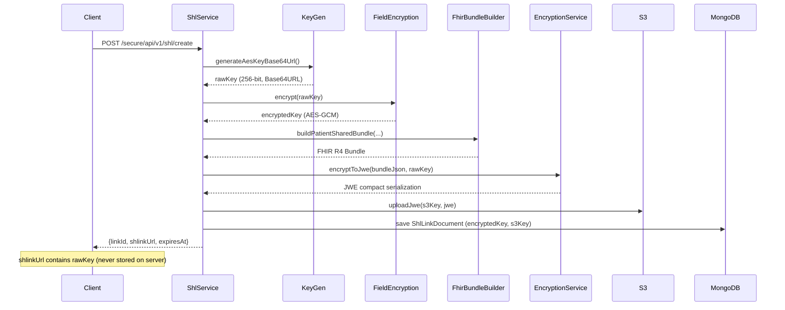

# hs-api Developer Guide

A comprehensive guide for backend engineers maintaining and extending the hs-api project.

hs-api is a Spring Boot 4.0.3 / Java 25 backend that provides two primary interfaces:
1. A **GraphQL API** exposing 13 queries across 11 FHIR R4 resource types from AWS HealthLake.
2. A **REST API** implementing HL7 Smart Health Links (SHL) for creating shareable, encrypted health data links.

Cross-references: [architecture.md](architecture.md) | [data-dictionary.md](data-dictionary.md) | [e2e-curl-commands.md](e2e-curl-commands.md)

---

## Table of Contents

1. [Prerequisites](#1-prerequisites)
2. [Local Development Setup](#2-local-development-setup)
3. [Environment Variables Reference](#3-environment-variables-reference)
4. [Architecture Overview](#4-architecture-overview)
5. [Code Patterns](#5-code-patterns)
6. [Adding a New FHIR Resource Type](#6-adding-a-new-fhir-resource-type)
7. [Encryption Flow](#7-encryption-flow)
8. [SHL Protocol Implementation](#8-shl-protocol-implementation)
9. [Testing Approach](#9-testing-approach)
10. [Jackson 2/3 Coexistence](#10-jackson-23-coexistence)
11. [MongoDB Collections and Indexes](#11-mongodb-collections-and-indexes)
12. [PDF Generation](#12-pdf-generation)

---

## 1. Prerequisites

### JDK 25 LTS

Java 25 is the first LTS since JDK 21 (GA September 16, 2025). Install 25.0.2+ via SDKMAN:

```bash
sdk install java 25.0.2-tem && sdk use java 25.0.2-tem
java --version   # openjdk 25.0.2 ...
```

Key Java 25 features used: Virtual Threads (JEP 444), Record Patterns (JEP 440), Scoped Values (JEP 506, final). Structured Concurrency (JEP 505) is still preview -- the project does not use it. String Templates were withdrawn in JDK 23 -- never use `STR."..."` syntax.

### Docker

Required for MongoDB via docker-compose during local development.

```bash
docker --version
docker compose version
```

### AWS CLI v2

Must be configured with credentials for HealthLake and S3 in `ap-south-1`. The application uses `DefaultCredentialsProvider` (supports env vars, `~/.aws/credentials`, IAM roles, SSO).

```bash
aws --version       # aws-cli/2.x.x ...
aws configure       # or: aws configure sso
```

### Maven

Use the bundled wrapper (`./mvnw`) or system Maven 3.9+.

```bash
./mvnw --version    # or: mvn --version
```

---

## 2. Local Development Setup

```bash
# 1. Clone
git clone <repository-url> && cd hs-api

# 2. Start MongoDB
docker compose up -d

# 3. Verify AWS credentials
aws sts get-caller-identity

# 4. Run with dev profile
./mvnw spring-boot:run -Dspring-boot.run.profiles=dev
```

The `dev` profile (`application-dev.yaml`) configures:

| Setting | Dev Value |
|---------|-----------|
| MongoDB URI | `mongodb://localhost:27017/healthsafe` |
| GraphiQL | **enabled** |
| HealthLake Endpoint | `https://healthlake.ap-south-1.amazonaws.com/datastore/8beccfc1f6ca1e8419ae9f29e5a46be5/r4/` |
| S3 Bucket | `healthsafe-shl-ap-south-1` |
| Encryption Key | `dev-encryption-key-32bytes-long!` |
| Base URL | `http://localhost:8080` |
| CORS Origins | `http://localhost:3000` |

Once running: health check at `http://localhost:8080/actuator/health`, GraphiQL at `http://localhost:8080/graphiql`.

Example GraphQL query to test in GraphiQL:
```graphql
query {
  resourceCounts(enterpriseId: "your-enterprise-id") {
    medications
    immunizations
    allergies
    conditions
    total
  }
}
```

### Build Commands

```bash
./mvnw compile                                     # Compile only
./mvnw test                                        # Run tests (requires Docker)
./mvnw package -DskipTests                         # Package as JAR
java -jar target/hs-api-0.0.1-SNAPSHOT.jar --spring.profiles.active=dev  # Run JAR
```

---

## 3. Environment Variables Reference

| Variable | Required | Default | Description |
|----------|----------|---------|-------------|
| `MONGODB_URI` | No | `mongodb://localhost:27017/hsapi` | MongoDB connection string |
| `MONGODB_DATABASE` | No | `hsapi` | Database name |
| `AWS_REGION` | No | `ap-south-1` | AWS region |
| `HEALTHLAKE_ENDPOINT` | Yes (prod) | _(empty)_ | HealthLake datastore endpoint URL |
| `S3_BUCKET` | Yes (prod) | _(empty)_ | S3 bucket for JWE payloads |
| `ENCRYPTION_KEY` | Yes | _(empty)_ | 32-byte key for AES-GCM field encryption |
| `APP_BASE_URL` | No | `http://localhost:8080` | Base URL for SHLink URIs |
| `CORS_ALLOWED_ORIGINS` | No | `http://localhost:3000` | Comma-separated allowed origins |
| `OAUTH2_ISSUER_URI` | No | _(empty)_ | OAuth2 JWT issuer URI (optional) |

---

## 4. Architecture Overview

See [architecture.md](architecture.md) for the full specification.

### Package Structure

```
com.chanakya.hsapi/
  HsApiApplication.java
  config/       -- SecurityConfig, MongoConfig, AwsConfig, GraphQlConfig, JacksonConfig,
                   WebMvcConfig, CryptoConfig
  auth/         -- ExternalAuthFilter (X-Consumer-Id validation), RequestContext
  common/
    exception/  -- ErrorResponse record, GlobalExceptionHandler (@RestControllerAdvice)
    filter/     -- RequestIdFilter (X-Request-Id + MDC), SecurityHeadersFilter (HSTS, CSP, etc.)
  crosswalk/    -- PatientCrosswalkDocument, Repository, Service (enterpriseId <-> HealthLake patientId)
  crypto/       -- EncryptionService (JWE dir+A256GCM), FieldEncryptionService (AES-GCM at rest),
                   KeyGenerationService
  fhir/         -- FhirClient (SigV4 signed HTTP), FhirBundleBuilder (parallel CompletableFuture),
                   FhirSerializationService, SigV4RequestInterceptor
  graphql/      -- 11 controllers (Medication, Immunization, Allergy, Condition, Procedure,
                   LabResult, Coverage, Claim, Appointment, CareTeam, Patient) +
                   ResourceCountsController
    transform/  -- 11 transform classes (FHIR model -> GraphQL record)
    type/       -- 13 record types (10 resources + PatientSummary + ResourceCounts + HealthDashboard)
  pdf/          -- PdfGenerationService (OpenHTMLtoPDF 1.1.37 + Thymeleaf)
  shl/          -- ShlController (/secure/api/v1/shl/*), ShlPublicController (/shl/{id})
    dto/        -- ShlCreateRequest, ShlCreateResponse, ShlSearchRequest, ShlRevokeRequest,
                   ShlLinkResponse, ManifestResponse
    model/      -- ShlLinkDocument, ShlAuditLogDocument, AccessRecord, ShlMode, ShlStatus,
                   ShlFlag, ShlAuditAction, FhirResourceType, IdType
    repository/ -- ShlLinkRepository, ShlAuditLogRepository
    service/    -- ShlService, ShlRetrievalService, ShlinkBuilder
  storage/      -- S3PayloadService (upload/download/delete JWE from S3)
  audit/        -- AuditLogDocument, AuditLogRepository, AuditService
```

### FHIR R4 Resource Types

| Enum Value | FHIR Resource | GraphQL Query | GraphQL Type |
|------------|---------------|---------------|--------------|
| `MedicationRequest` | MedicationRequest | `medications` | `Medication` |
| `Immunization` | Immunization | `immunizations` | `Immunization` |
| `AllergyIntolerance` | AllergyIntolerance | `allergies` | `Allergy` |
| `Condition` | Condition | `conditions` | `Condition` |
| `Procedure` | Procedure | `procedures` | `Procedure` |
| `Observation` | Observation | `labResults` | `LabResult` |
| `Coverage` | Coverage | `coverages` | `Coverage` |
| `ExplanationOfBenefit` | ExplanationOfBenefit | `claims` | `Claim` |
| `Appointment` | Appointment | `appointments` | `Appointment` |
| `CareTeam` | CareTeam | `careTeams` | `CareTeam` |
| `Patient` | Patient | `patientSummary` | `PatientSummary` |

Plus aggregate queries: `resourceCounts` and `healthDashboard`.

### Request Flow

```
Client -> RequestIdFilter (Order 0) -> SecurityHeadersFilter (Order 1)
       -> ExternalAuthFilter (X-Consumer-Id for /secure/api/**)
       -> SecurityFilterChain (Spring Security)
       -> DispatcherServlet
           |-> /graphql      -> @QueryMapping controllers -> CrosswalkService -> FhirClient
           |                    -> HealthLake -> Transform -> GraphQL records
           |-> /secure/api/* -> ShlController -> ShlService -> KeyGen, Crosswalk,
           |                    FhirBundleBuilder, Encryption, S3, Audit
           |-> /shl/{id}     -> ShlPublicController -> ShlRetrievalService
                                -> S3 download or live bundle + JWE + audit
```

---

## 5. Code Patterns

### Records for DTOs

All DTOs and GraphQL types are Java records:

```java
public record MedicationType(String id, String name, String status,
    String dosage, String reason, LocalDate startDate, LocalDate endDate) {}

public record ShlCreateResponse(String linkId, String shlinkUrl, Instant expiresAt) {}

public record ErrorResponse(String error, String message, Instant timestamp, String path) {
    public static ErrorResponse of(String error, String message, String path) {
        return new ErrorResponse(error, message, Instant.now(), path);
    }
}
```

Use records for all new types unless mutability is needed (like `ShlLinkDocument`).

### Virtual Threads

`spring.threads.virtual.enabled=true` -- all requests run on virtual threads automatically. The project uses `Apache5HttpClient` (not default Apache 4.5) for the AWS SDK to avoid carrier thread pinning. MongoDB driver 5.6.x is virtual-thread-safe. For parallel fan-out, `CompletableFuture` is used:

```java
// FhirBundleBuilder.java -- parallel fetch of multiple resource types
List<CompletableFuture<Bundle>> futures = selectedResources.stream()
    .map(rt -> CompletableFuture.supplyAsync(() -> fhirClient.searchResources(rt, patientId)))
    .toList();
CompletableFuture.allOf(futures.toArray(CompletableFuture[]::new)).join();
```

### Security Filter Chain

```java
.authorizeHttpRequests(auth -> auth
    .requestMatchers("/shl/**").permitAll()                // Public HL7 protocol
    .requestMatchers("/health", "/actuator/health").permitAll()
    .requestMatchers("/secure/api/**").authenticated()     // Requires X-Consumer-Id
    .anyRequest().denyAll()
)
```

`ExternalAuthFilter` validates the `X-Consumer-Id` header for `/secure/api/**` paths and sets `SecurityContext`. Returns 401 if missing. Optional OAuth2 JWT via `OAUTH2_ISSUER_URI`.

CORS: `/shl/**` is open (any origin), `/secure/api/**` is restricted to `CORS_ALLOWED_ORIGINS`.

Security headers (via `SecurityHeadersFilter`): HSTS, CSP (`default-src 'none'`), X-Content-Type-Options, X-Frame-Options DENY, no-cache.

### FHIR Transform Pattern

Each resource type has a `@Component` Transform class converting FHIR Bundle entries to records:

```java
@Component
public class MedicationTransform {
    public List<MedicationType> transform(Bundle bundle) {
        if (bundle == null || bundle.getEntry() == null) return List.of();
        return bundle.getEntry().stream()
            .filter(e -> e.getResource() instanceof MedicationRequest)
            .map(e -> (MedicationRequest) e.getResource())
            .map(this::toType)
            .toList();
    }

    private MedicationType toType(MedicationRequest mr) {
        String name = mr.hasMedicationCodeableConcept()
            ? mr.getMedicationCodeableConcept().getText() : null;
        // ... null-safe field extraction using has*() methods
        return new MedicationType(mr.getIdElement().getIdPart(), name, ...);
    }
}
```

### GraphQL Controller Pattern

```java
@Controller
public class MedicationController {
    @QueryMapping
    public List<MedicationType> medications(@Argument String enterpriseId,
                                            @Argument String startDate,
                                            @Argument String endDate,
                                            @Argument String sortOrder) {
        String patientId = crosswalk.resolveHealthLakePatientId(enterpriseId);
        var bundle = fhirClient.searchResources("MedicationRequest", patientId);
        var results = transform.transform(bundle);
        results = filterAndSort(results, startDate, endDate, sortOrder, MedicationType::startDate);
        auditService.logFhirQuery(enterpriseId, FhirResourceType.MedicationRequest, request);
        return results;
    }
}
```

GraphQL limits configured in `GraphQlConfig`:
```java
@Bean
public Instrumentation maxQueryComplexityInstrumentation() {
    return new MaxQueryComplexityInstrumentation(200);
}
@Bean
public Instrumentation maxQueryDepthInstrumentation() {
    return new MaxQueryDepthInstrumentation(10);
}
```

These are registered as `@Bean` definitions and auto-detected by Spring for GraphQL 2.0.

### Request ID Tracking

`RequestIdFilter` (Order 0) handles distributed tracing:
- Accepts an incoming `X-Request-Id` header if it matches `^[a-zA-Z0-9\-]{1,64}$`.
- Generates a UUID if no valid header is provided.
- Sets the ID in: response header (`X-Request-Id`), request attribute (`requestId`), SLF4J MDC (`requestId`).

### Error Handling

| Exception | Status | Code |
|-----------|--------|------|
| `IllegalArgumentException` | 400 | `bad_request` |
| `MethodArgumentNotValidException` | 400 | `validation_error` |
| `NoSuchElementException` | 404 | `not_found` |
| `Exception` (catch-all) | 500 | `internal_error` |

All errors return the `ErrorResponse` record format:
```json
{
    "error": "bad_request",
    "message": "expiresAt is required",
    "timestamp": "2026-03-06T10:30:00Z",
    "path": "/secure/api/v1/shl/create"
}
```

---

## 6. Adding a New FHIR Resource Type

Step-by-step guide using `DiagnosticReport` as an example:

**Step 1** -- Add to `FhirResourceType` enum in `shl/model/FhirResourceType.java`:
```java
DiagnosticReport   // add new value
```

**Step 2** -- Create type record in `graphql/type/DiagnosticReportType.java`:
```java
public record DiagnosticReportType(String id, String name, String status,
    String category, LocalDate effectiveDate, String conclusion) {}
```

**Step 3** -- Create transform in `graphql/transform/DiagnosticReportTransform.java`:
```java
@Component
public class DiagnosticReportTransform {
    public List<DiagnosticReportType> transform(Bundle bundle) {
        if (bundle == null || bundle.getEntry() == null) return List.of();
        return bundle.getEntry().stream()
            .filter(e -> e.getResource() instanceof DiagnosticReport)
            .map(e -> (DiagnosticReport) e.getResource())
            .map(this::toType)
            .toList();
    }

    private DiagnosticReportType toType(DiagnosticReport dr) {
        String name = dr.hasCode() ? dr.getCode().getText() : null;
        LocalDate effectiveDate = dr.hasEffectiveDateTimeType()
            ? dr.getEffectiveDateTimeType().getValue()
                .toInstant().atZone(ZoneId.systemDefault()).toLocalDate()
            : null;
        return new DiagnosticReportType(
            dr.getIdElement().getIdPart(), name,
            dr.hasStatus() ? dr.getStatus().toCode() : null,
            dr.hasCategory() && !dr.getCategory().isEmpty()
                ? dr.getCategory().getFirst().getText() : null,
            effectiveDate,
            dr.hasConclusion() ? dr.getConclusion() : null
        );
    }
}
```

**Step 4** -- Create controller in `graphql/DiagnosticReportController.java`:
```java
@Controller
public class DiagnosticReportController {
    private final PatientCrosswalkService crosswalk;
    private final FhirClient fhirClient;
    private final DiagnosticReportTransform transform;
    private final AuditService auditService;
    private final HttpServletRequest request;
    // constructor injection ...

    @QueryMapping
    public List<DiagnosticReportType> diagnosticReports(@Argument String enterpriseId,
                                                          @Argument String startDate,
                                                          @Argument String endDate,
                                                          @Argument String sortOrder) {
        String patientId = crosswalk.resolveHealthLakePatientId(enterpriseId);
        var bundle = fhirClient.searchResources("DiagnosticReport", patientId);
        var results = transform.transform(bundle);
        results = MedicationController.filterAndSort(
            results, startDate, endDate, sortOrder, DiagnosticReportType::effectiveDate);
        auditService.logFhirQuery(enterpriseId, FhirResourceType.DiagnosticReport, request);
        return results;
    }
}
```

**Step 5** -- Add query and type to `schema.graphqls`:
```graphql
diagnosticReports(enterpriseId: String!, startDate: String, endDate: String, sortOrder: SortOrder): [DiagnosticReport!]!

type DiagnosticReport { id: String, name: String, status: String, ... }
```

**Step 6** -- Update `ResourceCountsController` and `ResourceCountsType` to include the count.

**Step 7** -- Add to `RESOURCE_TYPE_MAP` in `FhirBundleBuilder.java`:
```java
Map.entry("DiagnosticReport", "DiagnosticReport"),
```

**Step 8** -- Add tests (transform unit test, `@GraphQlTest` controller test, integration test).

---

## 7. Encryption Flow

The project uses two distinct encryption mechanisms:

### Field Encryption (At Rest)

Encrypts the AES key stored in each `ShlLinkDocument` in MongoDB.

- **Algorithm**: AES-GCM (`AES/GCM/NoPadding`), 128-bit tag, 12-byte random IV
- **Key**: `ENCRYPTION_KEY` env var (16, 24, or 32 bytes UTF-8)
- **Format**: `Base64URL(IV || ciphertext || GCM-tag)` (no padding)

Implementation in `FieldEncryptionService`:
```java
// Encrypt: 12-byte random IV prepended to ciphertext+tag, Base64URL encoded
byte[] iv = new byte[12];
new SecureRandom().nextBytes(iv);
Cipher cipher = Cipher.getInstance("AES/GCM/NoPadding");
cipher.init(Cipher.ENCRYPT_MODE, secretKey, new GCMParameterSpec(128, iv));
byte[] ciphertext = cipher.doFinal(plaintext.getBytes(UTF_8));
return Base64.getUrlEncoder().withoutPadding().encodeToString(concat(iv, ciphertext));

// Decrypt: split IV from ciphertext+tag, AES-GCM decrypt
byte[] decoded = Base64.getUrlDecoder().decode(encrypted);
byte[] iv = Arrays.copyOfRange(decoded, 0, 12);
byte[] ciphertext = Arrays.copyOfRange(decoded, 12, decoded.length);
```

### JWE Encryption (In Transport)

Encrypts FHIR Bundles for S3 storage and SHL recipient delivery.

- **Library**: Nimbus JOSE-JWT 10.8
- **Algorithm**: `dir` (direct key agreement -- the AES key is used directly, no key wrapping)
- **Encryption**: `A256GCM`
- **Compression**: `DEF` (DEFLATE -- compresses plaintext before encryption)
- **Content type**: `application/fhir+json`
- **Output**: 5-part JWE compact serialization (`header.encryptedKey.iv.ciphertext.tag`)

Implementation in `EncryptionService`:
```java
JWEHeader header = new JWEHeader.Builder(JWEAlgorithm.DIR, EncryptionMethod.A256GCM)
    .contentType("application/fhir+json")
    .compressionAlgorithm(CompressionAlgorithm.DEF)
    .build();
JWEObject jwe = new JWEObject(header, new Payload(plaintext));
jwe.encrypt(new DirectEncrypter(key));
return jwe.serialize();
```

### End-to-End Flow



**Key security property**: The raw AES key exists only in the SHLink URI (held by sharer/recipient). The server stores only the field-encrypted version. Compromising both database and S3 does not expose FHIR data without the key from the SHLink URI.

---

## 8. SHL Protocol Implementation

Implements the [HL7 SMART Health Links](https://docs.smarthealthit.org/smart-health-links/) specification.

### SHLink URI Format

```
shlink:/{base64url(json-payload)}
```

Where `json-payload` contains:
```json
{
    "url": "https://api.example.com/shl/abc123",
    "flag": "U",
    "key": "base64url-encoded-256-bit-AES-key",
    "exp": 1741305600,
    "label": "My Health Summary"
}
```

Built by `ShlinkBuilder`: the `url` points to the public `/shl/{id}` endpoint, `flag` indicates snapshot (`U`) or live (`L`), `key` is the raw AES key for JWE decryption, `exp` is the expiry as Unix epoch seconds, and `label` is a human-readable description.

### Snapshot Mode (U Flag)

**Creation:**
1. Client POSTs to `/secure/api/v1/shl/create` with `mode: "snapshot"`.
2. Server resolves `enterpriseId` to HealthLake patient ID via crosswalk.
3. `FhirBundleBuilder` fetches Patient + selected resources from HealthLake (parallel).
4. If `includePdf: true`, `PdfGenerationService` generates a patient summary PDF.
5. FHIR Bundle is serialized to JSON, encrypted to JWE, uploaded to S3 at `shl/{enterpriseId}/{linkId}.jwe`.
6. `ShlLinkDocument` saved to MongoDB with field-encrypted AES key and S3 key.
7. Returns `ShlCreateResponse` with the `shlink:/` URI containing the raw AES key.

**Retrieval:**
1. Recipient GETs `/shl/{id}?recipient=...`.
2. Server validates link exists, is active (not expired/revoked), and flag is `U`.
3. Downloads JWE from S3.
4. Returns JWE as response body with `Content-Type: application/jose`.
5. Recipient decrypts JWE client-side using the key embedded in the SHLink URI.

### Live Mode (L Flag)

**Creation:**
1. Client POSTs to `/secure/api/v1/shl/create` with `mode: "live"`.
2. Same as snapshot except no bundle is built and no S3 upload occurs.
3. Link document saved with `s3Key: null`.

**Retrieval:**
1. Recipient POSTs to `/shl/{id}` with `{"recipient":"..."}`.
2. Server validates link, then builds a fresh FHIR Bundle from HealthLake in real time.
3. Encrypts the bundle to JWE using the stored (field-decrypted) AES key.
4. Returns a `ManifestResponse`:

```json
{"status":"can-change","files":[{"contentType":"application/fhir+json","embedded":"eyJ..."}]}
```

### Flag Validation

`U` flag links accept only GET. `L` flag links accept only POST. Mismatches are denied with audit logging.

### Effective Status

Computed dynamically: `"revoked"` if status is revoked, `"expired"` if `expiresAt < now`, otherwise `"active"`.

### Access History

Each link stores the last 50 `AccessRecord` entries in an embedded array. New records are pushed using a MongoDB `$push` with `$slice: -50` to cap the array:

```java
Update update = new Update().push("accessHistory").slice(-50).each(record);
mongoTemplate.updateFirst(query, update, ShlLinkDocument.class);
```

Each `AccessRecord` contains: `recipient` (identifier of the accessing party), `action` (`ACCESSED`, `ACCESS_REVOKED`, `ACCESS_EXPIRED`), and `timestamp`.

### Audit Logging

Every SHL action is logged to the `shl_audit_log` collection with:
- `linkId`, `enterpriseId`
- `action` (enum: `LINK_CREATED`, `LINK_REVOKED`, `LINK_ACCESSED`, `LINK_ACCESS_EXPIRED`, `LINK_ACCESS_REVOKED`, `LINK_DENIED`)
- `recipient` (hashed identifier)
- `metadata` (action-specific: mode, flag, contentHash, denial reason)
- IP address, User-Agent, requestId from the HTTP request

### Secured Endpoints

| Method | Path | Description |
|--------|------|-------------|
| POST | `/secure/api/v1/shl/create` | Create a new SHL link |
| POST | `/secure/api/v1/shl/search` | Search links by enterprise ID |
| POST | `/secure/api/v1/shl/get` | Get a single link by ID |
| POST | `/secure/api/v1/shl/preview` | Preview decrypted FHIR Bundle |
| POST | `/secure/api/v1/shl/revoke` | Revoke a link |

### Expiry Validation

`expiresAt` must be a valid ISO-8601 timestamp, at least 5 minutes and at most 365 days from now.

---

## 9. Testing Approach

### Test Dependencies

```xml
spring-boot-starter-test           <!-- JUnit 5, Mockito, AssertJ -->
spring-boot-starter-graphql-test   <!-- GraphQlTester for @GraphQlTest -->
spring-security-test               <!-- Security test utilities -->
spring-boot-webmvc-test            <!-- @AutoConfigureMockMvc (relocated in Boot 4) -->
spring-boot-testcontainers         <!-- @ServiceConnection support -->
testcontainers-mongodb:2.0.3       <!-- Testcontainers 2.0 artifact name -->
```

### Spring Boot 4 Testing Notes

- `@AutoConfigureMockMvc` moved to `org.springframework.boot.webmvc.test.autoconfigure` -- requires `spring-boot-webmvc-test`.
- `@ServiceConnection` requires `spring-boot-testcontainers`.
- Testcontainers 2.0: use `testcontainers-mongodb` (not `mongodb`), import `org.testcontainers.mongodb.MongoDBContainer`.

### Test Suite (12 classes)

| Test Class | Type | Coverage |
|------------|------|----------|
| `HsApiApplicationTests` | Integration | Context loads |
| `ShlServiceTest` | Unit | Create, search, get, revoke logic |
| `ShlCreateFlowTest` | Integration | Full creation end-to-end |
| `JweComplianceTest` | Unit | JWE round-trip, header verification |
| `CryptoRoundTripTest` | Unit | AES-GCM field encryption |
| `ManifestRetrievalTest` | Integration | Live mode retrieval |
| `SnapshotRetrievalTest` | Integration | Snapshot mode retrieval |
| `SecurityBoundaryTest` | Integration | Permit/deny rules, missing auth |
| `ExpiryValidationTest` | Unit | Min/max expiry ranges |
| `PshdBundleComplianceTest` | Unit | FHIR Bundle structure |
| `ShlinkUriComplianceTest` | Unit | SHLink URI format |
| `PatientCrosswalkIntegrationTest` | Integration | Crosswalk MongoDB integration |

### Example: Unit Test with Mockito

```java
@ExtendWith(MockitoExtension.class)
class ShlServiceTest {
    @Mock private ShlLinkRepository linkRepository;
    @Mock private KeyGenerationService keyGen;
    @Mock private EncryptionService encryption;
    // ... other mocks
    @InjectMocks private ShlService shlService;

    @Test
    void create_snapshotMode_savesLinkAndUploadsJwe() {
        when(keyGen.generateLinkId()).thenReturn("test-link-id");
        when(keyGen.generateAesKeyBase64Url()).thenReturn("base64url-key");
        // ... setup

        ShlCreateResponse response = shlService.create(request, httpRequest);

        assertThat(response.linkId()).isEqualTo("test-link-id");
        verify(s3).uploadJwe(anyString(), anyString());
    }
}
```

### Example: Integration Test with Testcontainers

```java
@SpringBootTest
@Testcontainers
class PatientCrosswalkIntegrationTest {
    @Container
    @ServiceConnection
    static MongoDBContainer mongoContainer = new MongoDBContainer("mongo:7");

    @Autowired
    private PatientCrosswalkRepository repository;

    @Test
    void resolvePatientId_existingCrosswalk_returnsHealthLakeId() {
        // test with real MongoDB via Testcontainers
    }
}
```

### Example: GraphQL Controller Test

```java
@GraphQlTest(MedicationController.class)
class MedicationControllerTest {
    @Autowired private GraphQlTester graphQlTester;
    @MockitoBean private PatientCrosswalkService crosswalk;
    @MockitoBean private FhirClient fhirClient;

    @Test
    void medications_returnsTransformedResults() {
        graphQlTester.document("""
            query {
                medications(enterpriseId: "E001") { id name status }
            }
            """)
            .execute()
            .path("medications")
            .entityList(MedicationType.class)
            .hasSize(3);
    }
}
```

### Running Tests

```bash
./mvnw test                              # All tests (requires Docker)
./mvnw test -Dtest=ShlServiceTest        # Single class
./mvnw test -Dtest="com.chanakya.hsapi.shl.*"  # Pattern
```

---

## 10. Jackson 2/3 Coexistence

### The Situation

- **Spring Boot 4** uses Jackson 3 (`tools.jackson` package, `JsonMapper` class) for HTTP serialization.
- **HAPI FHIR 8.8.0** uses Jackson 2 (`com.fasterxml.jackson` package, `ObjectMapper` class) internally.

### Why No Conflict

Different Java packages = both JARs coexist without conflict. No dual-stack configuration needed.

| | Jackson 2 (HAPI FHIR) | Jackson 3 (Spring Boot 4) |
|---|---|---|
| Group ID | `com.fasterxml.jackson` | `tools.jackson` |
| Mapper | `ObjectMapper` | `JsonMapper` |

### Serialization Paths

1. **Spring HTTP responses**: Records (`ShlCreateResponse`, `MedicationType`, etc.) serialized by Jackson 3 `JsonMapper` automatically.
2. **FHIR serialization**: `FhirContext.forR4()` uses HAPI's own parser (Jackson 2 internally). Never passes through Spring's `JsonMapper`.
3. **Boundary**: Transform classes convert HAPI FHIR models to plain records. HAPI models are never returned directly from controllers.

### Rules

- Never register `FhirContext` or FHIR resources with Spring's Jackson 3 `JsonMapper`.
- Never return HAPI FHIR model objects from `@RestController` or `@QueryMapping` methods.
- `@JsonComponent` targets Jackson 3 by default in Boot 4 -- do not use for FHIR resources.

---

## 11. MongoDB Collections and Indexes

See [data-dictionary.md](data-dictionary.md) for complete schemas.

### Collections

| Collection | Document Class | Purpose |
|------------|----------------|---------|
| `shl_links` | `ShlLinkDocument` | Smart Health Link records |
| `shl_audit_log` | `ShlAuditLogDocument` | SHL audit trail |
| `audit_log` | `AuditLogDocument` | General audit (FHIR queries) |
| `patient_crosswalk` | `PatientCrosswalkDocument` | Enterprise ID to HealthLake patient ID |

### Indexes

Created programmatically in `MongoConfig` on `ApplicationReadyEvent` (auto-index-creation is disabled):

| Collection | Index Name | Fields | Unique |
|------------|-----------|--------|--------|
| `shl_links` | `idx_enterpriseId_status` | `enterpriseId` ASC, `status` ASC | No |
| `shl_links` | `idx_expiresAt` | `expiresAt` ASC | No |
| `shl_audit_log` | `idx_linkId_timestamp` | `linkId` ASC, `timestamp` DESC | No |
| `shl_audit_log` | `idx_enterpriseId_timestamp` | `enterpriseId` ASC, `timestamp` DESC | No |
| `patient_crosswalk` | `idx_enterpriseId_unique` | `enterpriseId` ASC | **Yes** |
| `audit_log` | `idx_enterpriseId_timestamp` | `enterpriseId` ASC, `timestamp` DESC | No |

### Configuration Notes

- `_class` field disabled via `DefaultMongoTypeMapper(null)` in `MongoConfig`. This prevents Spring Data from writing `_class` discriminator fields into documents.
- Auto-index creation is disabled (`spring.data.mongodb.auto-index-creation: false`). Indexes are managed explicitly in `MongoConfig.createIndexes()` on `ApplicationReadyEvent`.
- Imperative `MongoRepository` (not reactive) -- virtual threads provide equivalent I/O scalability without reactive complexity.
- MongoDB driver 5.6.x is virtual-thread-safe by default.

---

## 12. PDF Generation

### Stack

- **OpenHTMLtoPDF** 1.1.37 (`io.github.openhtmltopdf:openhtmltopdf-pdfbox`) -- HTML to PDF via PDFBox.
- **Thymeleaf** -- HTML templating. Template at `src/main/resources/templates/pdf/patient-summary.html`.

### Process

1. Thymeleaf renders the template with `patientName` and context data.
2. OpenHTMLtoPDF converts rendered HTML to PDF (`useFastMode()` for performance).
3. PDF bytes are embedded in a FHIR `DocumentReference` in the SHL Bundle:
   - Type: LOINC `60591-5` ("Patient summary Document")
   - Category: `patient-shared`
   - Security label: `PATAST` ("patient asserted")
   - Attachment: `application/pdf` with inline data

Triggered when `includePdf: true` in `ShlCreateRequest`. Requires `patientName` to be non-blank.

### Implementation

```java
@Service
public class PdfGenerationService {
    private final TemplateEngine templateEngine;

    public byte[] generatePatientSummaryPdf(String patientName, Map<String, Object> data) {
        Context context = new Context();
        context.setVariable("patientName", patientName);
        context.setVariables(data);
        String html = templateEngine.process("pdf/patient-summary", context);

        try (var os = new ByteArrayOutputStream()) {
            PdfRendererBuilder builder = new PdfRendererBuilder();
            builder.useFastMode();
            builder.withHtmlContent(html, null);
            builder.toStream(os);
            builder.run();
            return os.toByteArray();
        } catch (Exception e) {
            throw new RuntimeException("PDF generation failed", e);
        }
    }
}
```

### FHIR DocumentReference

When a PDF is included in the SHL Bundle, `FhirBundleBuilder` creates a `DocumentReference`:
- **Status**: `current`
- **Type**: LOINC `60591-5` ("Patient summary Document")
- **Category**: Custom code `patient-shared` in `https://cms.gov/fhir/CodeSystem/patient-shared-category`
- **Subject/Author**: Reference to the Patient resource in the Bundle
- **Security label**: `PATAST` ("patient asserted") from `http://terminology.hl7.org/CodeSystem/v3-ObservationValue`
- **Attachment**: `application/pdf` content type with inline byte data

### Thymeleaf Configuration

```yaml
spring:
  thymeleaf:
    prefix: classpath:/templates/
    suffix: .html
    mode: HTML
    cache: true    # disable in dev if editing templates frequently
```

Note: The `groupId` for OpenHTMLtoPDF is `io.github.openhtmltopdf` (not `com.openhtmltopdf`).

---

## Appendix: Key Versions

| Technology | Version | Notes |
|------------|---------|-------|
| JDK | 25.0.2 (LTS) | First LTS since 21 |
| Spring Boot | 4.0.3 | Jackson 3 default |
| HAPI FHIR | 8.8.0 | Jackson 2 internally |
| AWS SDK v2 | 2.42.4 (BOM) | Apache5HttpClient |
| Nimbus JOSE-JWT | 10.8 | JWE encryption |
| OpenHTMLtoPDF | 1.1.37 | `io.github.openhtmltopdf` groupId |
| Testcontainers | 2.0.3 | New artifact names |
| MongoDB | 7.x (Docker) | Via docker-compose |
| Eclipse Parsson | 1.1.7 | Replaces GlassFish (CVE-2023-4043) |

### Maven Notes

- HAPI FHIR `structures-r4` excludes `org.glassfish:jakarta.json` (CVE-2023-4043), replaced by Parsson.
- AWS SDK uses `apache5-client` for virtual thread compatibility.
- Testcontainers uses `testcontainers-mongodb` (2.0 artifact name, not `mongodb`).
- Test deps include `spring-boot-webmvc-test` (relocated `@AutoConfigureMockMvc`) and `spring-boot-testcontainers` (`@ServiceConnection`).
