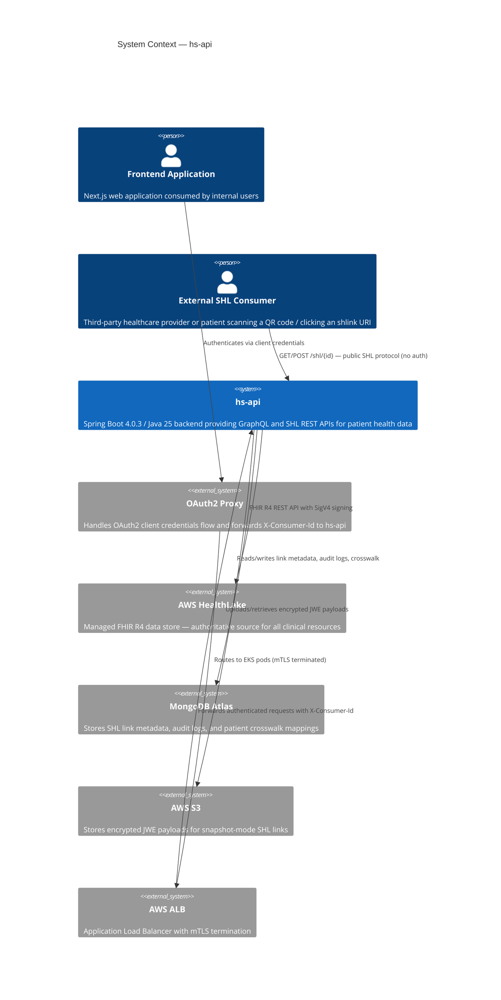
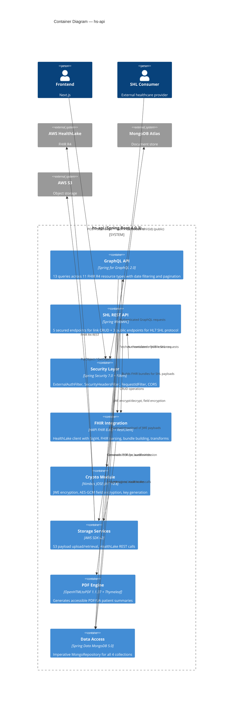
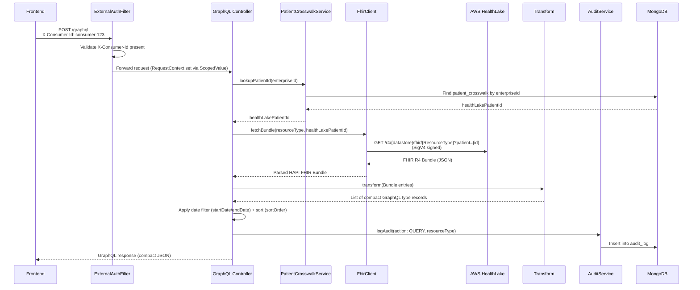
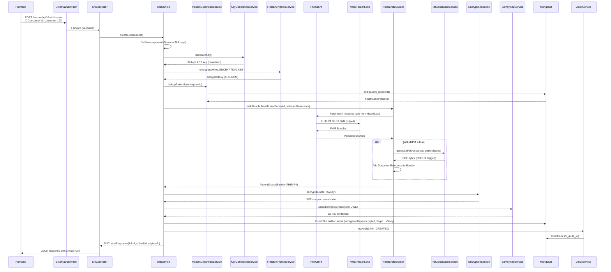
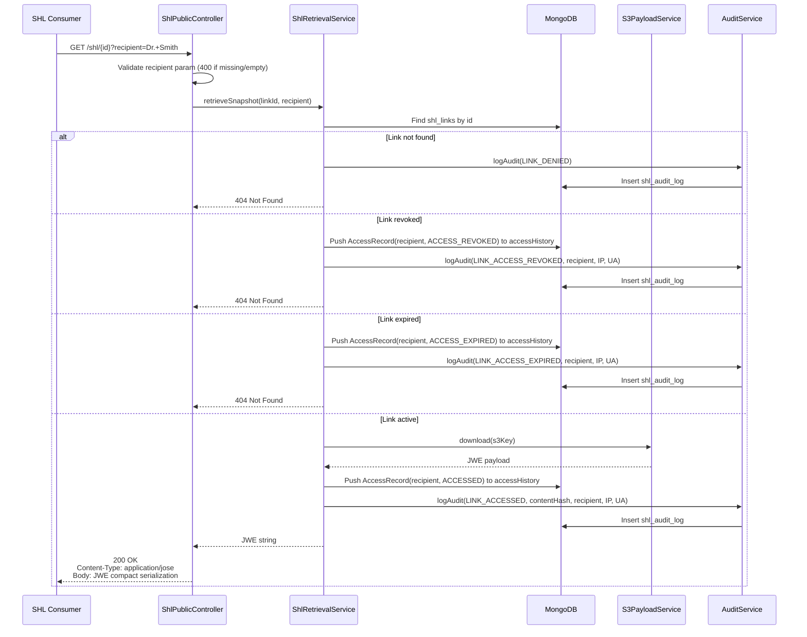
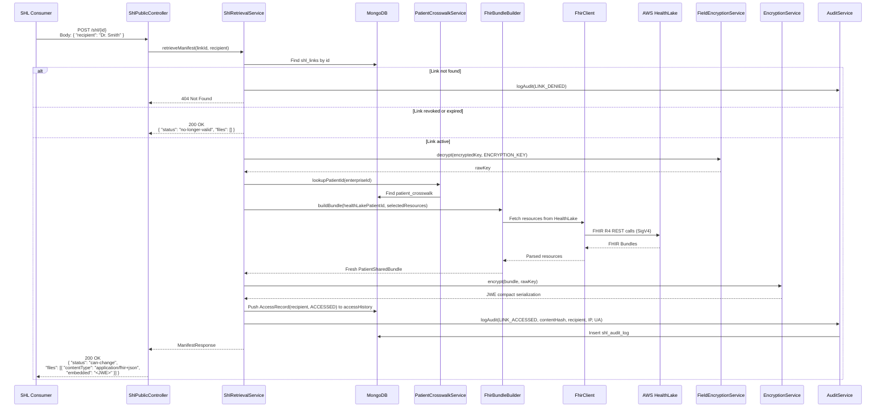
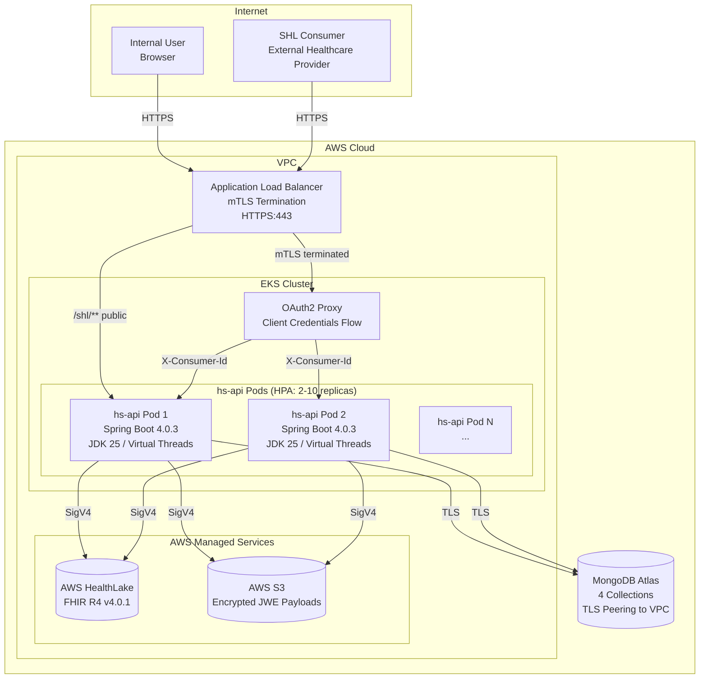

# Enterprise Architecture — hs-api

## 1. Executive Summary

The hs-api system is a Spring Boot 4.0.3 / Java 25 backend that provides secure, standards-compliant access to patient health data through two API surfaces: a GraphQL API serving 13 queries across 11 FHIR R4 resource types sourced from AWS HealthLake, and a REST API implementing the HL7 Smart Health Links (SHL) specification for creating shareable, encrypted health data links. The system employs defense-in-depth security with OAuth2 proxy-based authentication, AES-256-GCM encryption at rest, JWE encryption in transit, and leverages Java 25 virtual threads for high-throughput blocking I/O without reactive complexity. MongoDB stores operational metadata, AWS S3 stores encrypted payloads, and AWS HealthLake serves as the authoritative FHIR R4 data store. The architecture is designed for stateless horizontal scaling on EKS with zero carrier-thread pinning.

---

## 2. System Context (C4 Level 1)

The system context diagram identifies external actors and systems that interact with hs-api.



### Actor Descriptions

| Actor | Type | Interaction |
|-------|------|-------------|
| Frontend Application | Internal | Consumes GraphQL and secured SHL REST endpoints via OAuth2 proxy |
| External SHL Consumer | External | Accesses public SHL endpoints using shlink URIs (no authentication) |
| OAuth2 Proxy | Infrastructure | Authenticates consumers, injects `X-Consumer-Id` header |
| AWS ALB | Infrastructure | Terminates mTLS, routes traffic to EKS pods |
| AWS HealthLake | External Service | FHIR R4 data store (read-only from hs-api perspective) |
| MongoDB Atlas | External Service | Transactional data store for metadata and audit |
| AWS S3 | External Service | Object storage for encrypted SHL payloads |

---

## 3. Container Diagram (C4 Level 2)

The container diagram shows the major logical containers within and around the hs-api deployment boundary.



---

## 4. Component Diagram (C4 Level 3)

The component diagram maps to the Java package structure within the hs-api application.

```mermaid
C4Component
    title Component Diagram — hs-api Packages

    Container_Boundary(app, "com.chanakya.hsapi") {

        Component(config, "config/", "Configuration", "SecurityConfig, MongoConfig, AwsConfig, GraphQlConfig, JacksonConfig, WebMvcConfig, CryptoConfig")
        Component(auth, "auth/", "Authentication", "ExternalAuthFilter (OncePerRequestFilter), RequestContext (ScopedValue)")
        Component(commonFilter, "common/filter/", "HTTP Filters", "RequestIdFilter, SecurityHeadersFilter")
        Component(commonException, "common/exception/", "Error Handling", "GlobalExceptionHandler, ErrorResponse")

        Component(graphqlControllers, "graphql/", "GraphQL Controllers", "11 resource controllers + ResourceCountsController (13 queries)")
        Component(graphqlTransforms, "graphql/transform/", "FHIR Transforms", "11 transforms: FHIR Bundle entries to compact GraphQL types")
        Component(graphqlTypes, "graphql/type/", "GraphQL Types", "13 Java records matching schema.graphqls")

        Component(shlController, "shl/ShlController", "Secured SHL API", "POST /secure/api/v1/shl/* (search, get, preview, counts, history, create, revoke)")
        Component(shlPublicController, "shl/ShlPublicController", "Public SHL API", "GET /shl/{id}, POST /shl/{id}, OPTIONS /shl/{id}")
        Component(shlService, "shl/service/", "SHL Business Logic", "ShlService, ShlRetrievalService, ShlinkBuilder")
        Component(shlModel, "shl/model/", "SHL Domain", "ShlLinkDocument, ShlAuditLogDocument, enums, AccessRecord")
        Component(shlRepository, "shl/repository/", "SHL Persistence", "ShlLinkRepository, ShlAuditLogRepository")

        Component(crypto, "crypto/", "Cryptography", "EncryptionService (JWE), FieldEncryptionService (AES-GCM), KeyGenerationService")
        Component(fhir, "fhir/", "FHIR Integration", "FhirClient, SigV4RequestInterceptor, FhirBundleBuilder, FhirSerializationService")
        Component(crosswalk, "crosswalk/", "Patient Crosswalk", "PatientCrosswalkDocument, Repository, Service")
        Component(storage, "storage/", "S3 Storage", "S3PayloadService")
        Component(pdf, "pdf/", "PDF Generation", "PdfGenerationService (OpenHTMLtoPDF + Thymeleaf)")
        Component(audit, "audit/", "Audit Logging", "AuditLogDocument, AuditLogRepository, AuditService")
    }

    Rel(auth, config, "Configured by SecurityConfig")
    Rel(graphqlControllers, graphqlTransforms, "Delegates FHIR-to-GraphQL mapping")
    Rel(graphqlControllers, fhir, "Fetches FHIR bundles")
    Rel(graphqlControllers, crosswalk, "Resolves enterpriseId to HealthLake patient ID")
    Rel(graphqlControllers, audit, "Logs FHIR query audit entries")
    Rel(shlController, shlService, "Delegates business logic")
    Rel(shlPublicController, shlService, "Public retrieval delegation")
    Rel(shlService, shlRepository, "CRUD on shl_links, shl_audit_log")
    Rel(shlService, crypto, "JWE + field encryption")
    Rel(shlService, fhir, "Builds FHIR bundles")
    Rel(shlService, storage, "S3 payload upload/download")
    Rel(shlService, pdf, "Generates PDF for bundle inclusion")
    Rel(shlService, audit, "Writes SHL audit entries")
    Rel(fhir, storage, "HealthLake calls via RestClient + SigV4")
    Rel(crosswalk, shlRepository, "Shared MongoDB access")
```



---

## 5. Technology Decisions

| Decision | Technology | Version | Rationale |
|----------|-----------|---------|-----------|
| Runtime | Java 25 LTS | 25.0.2 | First LTS since 21. Finalizes Scoped Values, Compact Object Headers, Generational Shenandoah. Long-term support through 2033+ |
| Framework | Spring Boot | 4.0.3 | Latest stable. Native Jackson 3 support, Spring Framework 7.0.5, virtual thread integration |
| Concurrency | Virtual Threads | JEP 444 (final) | Every code path is blocking (FHIR REST, JCE, MongoDB, S3). Virtual threads scored 53/60 vs Reactive 33/60 in weighted analysis. Eliminates reactive complexity |
| Web Layer | Spring WebMVC | 7.0.5 | Imperative model paired with virtual threads. Simpler debugging, stack traces, and error handling than WebFlux |
| GraphQL | Spring for GraphQL | 2.0.x | Tight Boot integration, `@QueryMapping`/`@BatchMapping` annotations, auto-detected `Instrumentation` beans |
| FHIR Parsing | HAPI FHIR | 8.8.0 | De-facto Java FHIR library. R4 structures, context-based serialization, Jackson 2 internally (coexists with Spring's Jackson 3 via separate packages) |
| FHIR Data Store | AWS HealthLake | R4 v4.0.1 | Managed FHIR service with SigV4 auth, eliminates self-hosted FHIR server operations |
| Document Store | MongoDB Atlas | Driver 5.6.3 | Schema-flexible for SHL metadata and audit logs. Virtual-thread-safe driver. Imperative `MongoRepository` avoids reactive complexity |
| Object Storage | AWS S3 | SDK 2.42.4 | Durable storage for encrypted JWE payloads. Standard AWS integration with IAM-based access |
| JWE Encryption | Nimbus JOSE-JWT | 10.8 | Standards-compliant JWE with `alg: dir`, `enc: A256GCM`, `zip: DEF`. Automatic unique nonce/IV per encryption |
| PDF Generation | OpenHTMLtoPDF + Thymeleaf | 1.1.37 | PDF/UA tagged structure for accessibility (WCAG 2.0, Section 508). CSS `@font-face` for proprietary fonts |
| HTTP Client (AWS) | Apache5HttpClient | SDK 2.41.0+ | Virtual-thread-safe. Default Apache 4.5 client pins carrier threads under `spring.threads.virtual.enabled=true` |
| Auth Context | ScopedValue | JEP 506 (final in JDK 25) | Thread-safe request context for virtual threads. Replaces `ThreadLocal` which leaks across virtual thread pools |

---

## 6. Integration Points

| Integration | Protocol | Direction | Auth | Data Format | Notes |
|-------------|----------|-----------|------|-------------|-------|
| AWS HealthLake | HTTPS REST | Outbound | SigV4 (IAM default credential chain) | FHIR R4 JSON Bundles | Read-only. R4 v4.0.1 only. AWS CLI creds locally, IAM role in EKS |
| MongoDB Atlas | MongoDB Wire Protocol (TLS) | Bidirectional | Connection string with credentials | BSON documents | 4 collections. Programmatic indexes. Virtual-thread-safe driver |
| AWS S3 | HTTPS REST | Bidirectional | SigV4 (IAM default credential chain) | JWE compact serialization (`application/jose`) | Key pattern: `shl/{enterpriseId}/{linkId}.jwe` |
| OAuth2 Proxy | HTTPS (via ALB) | Inbound | mTLS at ALB, `X-Consumer-Id` header | HTTP headers | Spring Boot trusts proxy — no token validation |
| Frontend (Next.js) | HTTPS POST | Inbound | `X-Consumer-Id` (via OAuth2 proxy) | GraphQL / JSON | All secured endpoints use POST with IDs in body |
| External SHL Consumer | HTTPS GET/POST | Inbound | None (public) | `application/jose` (JWE) / JSON manifest | HL7 SHL protocol. Security via 256-bit entropy in link IDs + JWE encryption |

---

## 7. Security Architecture

### 7.1 Authentication Model

```
Consumer --> OAuth2 Proxy (client credentials) --> ALB (mTLS) --> Spring Boot (trusts X-Consumer-Id)
```

- Spring Boot performs NO OAuth2 token validation — the OAuth2 proxy is the sole authenticator
- `ExternalAuthFilter` (OncePerRequestFilter) rejects requests to `/secure/api/**` without a valid `X-Consumer-Id` header (HTTP 401)
- Public SHL endpoints (`/shl/{id}`) require no authentication per the HL7 SHL specification
- Network-level security: ALB + VPC security groups ensure only the OAuth2 proxy can reach `/secure/api/**` endpoints
- `X-Consumer-Id` header cannot be spoofed from outside the VPC

### 7.2 Authorization Model

- No role-based access control (RBAC) in v1 — all authenticated consumers have equal access
- Data scoping: `idType` + `idValue` in request body scopes every query to a specific patient
- No patient IDs exposed in URLs — all IDs travel in POST request bodies

### 7.3 Encryption

| Layer | Mechanism | Details |
|-------|-----------|---------|
| Encryption in transit (SHL) | JWE (RFC 7516) | `alg: dir`, `enc: A256GCM`, `zip: DEF`, `cty: application/fhir+json`. 32-byte AES key per link |
| Encryption at rest (MongoDB) | AES-256-GCM field encryption | Per-link encryption keys encrypted with a single `ENCRYPTION_KEY` environment variable before MongoDB storage |
| Encryption at rest (S3) | AWS SSE + JWE | S3 server-side encryption plus application-level JWE. Double encryption: DB breach alone does not expose keys |
| Network encryption | TLS 1.2+ | All inter-service communication over TLS. ALB terminates mTLS |
| Key material in URLs | SHLink URI | Raw AES key embedded in `shlink:/` URI (base64url). This is by design per HL7 SHL spec — the URI IS the credential |

### 7.4 Brute-Force Mitigation

- Link IDs: 32-byte `SecureRandom` (base64url, 43 characters) = 256-bit entropy = 2^256 possible IDs
- No enumeration possible — link ID space is astronomically large
- Phase 2 adds passcode support (P flag) with lifetime attempt tracking

### 7.5 Security Headers

All HTTP responses include the following headers (applied by `SecurityHeadersFilter`):

| Header | Value |
|--------|-------|
| `X-Content-Type-Options` | `nosniff` |
| `X-Frame-Options` | `DENY` |
| `X-XSS-Protection` | `0` |
| `Referrer-Policy` | `strict-origin-when-cross-origin` |
| `Content-Security-Policy` | `default-src 'none'; frame-ancestors 'none'` |
| `Strict-Transport-Security` | `max-age=31536000; includeSubDomains` |
| `Cache-Control` | `no-store` |
| `Pragma` | `no-cache` |

### 7.6 CORS Policy

| Path Pattern | Allowed Origins | Allowed Methods | Purpose |
|-------------|----------------|-----------------|---------|
| `/shl/**` | `*` (all origins) | GET, POST, OPTIONS | HL7 SHL protocol requires open access for any healthcare provider |
| `/secure/api/**` | Configured origin allowlist | POST | Restricted to known frontend origins |

### 7.7 Spring Security Filter Chain

```
/shl/**          --> permitAll()         (SHL protocol — key-in-URL is the auth)
/health          --> permitAll()         (Health checks)
/actuator/health --> permitAll()         (Actuator health)
/secure/api/**   --> ExternalAuthFilter  (Requires X-Consumer-Id header)
everything else  --> denyAll()
```

CSRF is disabled (API-only, no browser sessions).

---

## 8. Data Flow Diagrams

### 8.1 GraphQL Query Flow



### 8.2 SHL Snapshot Creation Flow



### 8.3 SHL Snapshot Retrieval Flow (GET — U Flag)



### 8.4 SHL Live Mode Retrieval Flow (POST — L Flag)



---

## 9. Data Architecture

This section provides a summary view of data stores and their roles. For complete field-level schemas, indexes, and enumerations, see [data-dictionary.md](data-dictionary.md).

### 9.1 MongoDB Collections

| Collection | Purpose | Key Fields | Indexes |
|-----------|---------|------------|---------|
| `shl_links` | SHL link metadata and embedded access history | `id`, `enterpriseId`, `mode`, `flag`, `encryptionKey`, `expiresAt`, `status`, `s3Key`, `accessHistory[]` | `{enterpriseId, status}`, `{expiresAt}` |
| `shl_audit_log` | Compliance-grade SHL audit trail (forensic) | `linkId`, `enterpriseId`, `action`, `recipient`, `ipAddress`, `userAgent`, `requestId`, `consumerId` | `{linkId, timestamp desc}`, `{enterpriseId, timestamp desc}` |
| `audit_log` | General FHIR query audit trail | `enterpriseId`, `action`, `resourceType`, `consumerId` | `{enterpriseId, timestamp desc}` |
| `patient_crosswalk` | Enterprise ID to HealthLake Patient ID mapping (1:1) | `enterpriseId` (unique), `healthLakePatientId` | `{enterpriseId}` unique |

All indexes are created programmatically in `MongoConfig.java`. See [data-dictionary.md](data-dictionary.md) for complete field definitions, embedded types, and enumeration values.

### 9.2 AWS HealthLake (FHIR R4)

HealthLake is the authoritative source for all clinical data. hs-api reads from HealthLake but never writes to it.

| FHIR R4 Resource | GraphQL Query | Clinical Domain |
|-----------------|---------------|-----------------|
| Patient | `patientSummary` | Demographics |
| MedicationRequest | `medications` | Medications |
| Immunization | `immunizations` | Immunizations |
| AllergyIntolerance | `allergies` | Allergies |
| Condition | `conditions` | Diagnoses / Problems |
| Procedure | `procedures` | Procedures |
| Observation | `labResults` | Lab Results |
| Coverage | `coverages` | Insurance Coverage |
| ExplanationOfBenefit | `claims` | Claims |
| Appointment | `appointments` | Appointments |
| CareTeam | `careTeams` | Care Team |

Additional aggregate queries: `resourceCounts` (per-type counts via parallel fan-out) and `healthDashboard` (all 11 types in parallel).

### 9.3 AWS S3 Objects

| Object Type | Key Pattern | Content-Type | Content |
|-------------|-------------|-------------|---------|
| SHL Snapshot Payload | `shl/{enterpriseId}/{linkId}.jwe` | `application/jose` | JWE compact serialization (5-part dot-separated) containing encrypted FHIR R4 PatientSharedBundle |

Objects are created at SHL link creation (snapshot mode) and read at SHL retrieval. Live-mode links have no S3 objects — bundles are built on demand.

---

## 10. Scalability Architecture

### 10.1 Virtual Thread Model

The application enables virtual threads via `spring.threads.virtual.enabled=true`. Every HTTP request is handled on a virtual thread, allowing the JVM to efficiently multiplex millions of concurrent blocking operations onto a small pool of carrier (platform) threads.

| Aspect | Design |
|--------|--------|
| Web server threads | Virtual threads (Tomcat virtual thread executor) |
| MongoDB calls | Blocking on virtual threads — driver 5.6.x is virtual-thread-safe |
| HealthLake calls | RestClient + SigV4 on virtual threads via Apache5HttpClient (no carrier-thread pinning) |
| S3 calls | AWS SDK sync client with Apache5HttpClient (virtual-thread-safe) |
| JWE encryption | CPU-bound JCE operations — briefly occupy carrier thread (acceptable) |
| Request context | `ScopedValue` (JEP 506, final in JDK 25) instead of `ThreadLocal` |

### 10.2 Parallel Fan-Out

`CompletableFuture.allOf()` is used for parallel HealthLake calls in two scenarios:

1. **`resourceCounts` query**: Fires 11 parallel count requests to HealthLake (one per resource type), each on its own virtual thread
2. **`healthDashboard` query**: Fetches all 11 resource types in parallel, transforms each, and aggregates results

`StructuredTaskScope` (JEP 505) remains in 5th preview in Java 25 and is not used. `CompletableFuture` provides adequate fan-out semantics without preview flags.

### 10.3 Horizontal Scaling

| Property | Detail |
|----------|--------|
| Statelessness | No server-side sessions. No in-memory caches. All state in MongoDB/S3/HealthLake |
| Pod scaling | EKS Horizontal Pod Autoscaler (HPA) based on CPU/memory and request rate |
| Database scaling | MongoDB Atlas auto-scaling. HealthLake is fully managed |
| No sticky sessions | Any pod can serve any request — ALB uses round-robin |
| Cold start | Minimal — Spring Boot starts in <5 seconds. No lazy-loaded caches to warm |

### 10.4 Performance Characteristics

| Operation | Latency Profile | Bottleneck |
|-----------|----------------|-----------|
| GraphQL query (single resource type) | ~200-500ms | HealthLake REST call |
| GraphQL resourceCounts (11 types parallel) | ~300-700ms | Slowest HealthLake call (parallel fan-out) |
| SHL create (snapshot, no PDF) | ~500-1500ms | HealthLake fetch + JWE encryption + S3 upload |
| SHL create (snapshot, with PDF) | ~1000-3000ms | PDF generation adds ~500-1500ms |
| SHL snapshot retrieval (GET) | ~50-200ms | S3 download (no HealthLake call) |
| SHL live retrieval (POST) | ~500-1500ms | On-demand HealthLake fetch + JWE encryption |
| Patient crosswalk lookup | ~5-20ms | MongoDB indexed query |

---

## 11. Deployment Topology



### Deployment Specifications

| Component | Configuration |
|-----------|--------------|
| Container image | JDK 25 slim base, Spring Boot fat JAR |
| Pod resources | CPU: 500m request / 2000m limit. Memory: 512Mi request / 1Gi limit |
| Replicas | Min 2 (HA), Max 10 (HPA) |
| HPA metrics | CPU utilization (target 70%), custom request-rate metric |
| Health probes | Liveness: `GET /actuator/health` (10s interval). Readiness: `GET /health` (5s interval) |
| JVM flags | `-XX:+UseZGC` (or Generational Shenandoah via `-XX:+UseShenandoahGC`), `-Xmx768m` |
| IAM | EKS Pod Identity for HealthLake and S3 access (not IRSA for new clusters) |
| Secrets | `ENCRYPTION_KEY` via EKS Secret (mounted as env var) |
| Networking | VPC security groups restrict `/secure/api/**` to OAuth2 proxy only |

---

## 12. Compliance Posture

### 12.1 Standards Compliance

| Standard | Scope | Compliance Level |
|----------|-------|-----------------|
| **FHIR R4 v4.0.1** | All clinical data exchange with HealthLake | Full — HAPI FHIR 8.8.0 validates R4 structures |
| **HL7 Smart Health Links (SHL)** | SHL link creation, retrieval, and encryption | Full v1 — U flag (snapshot) and L flag (live mode) implemented per spec |
| **Patient Shared Health Data (PSHD)** | PatientSharedBundle structure | Full — Patient + DocumentReference (LOINC 60591-5) + discrete resources per profile |
| **JWE (RFC 7516)** | SHL payload encryption | Full — `alg: dir`, `enc: A256GCM`, `zip: DEF` per SHL spec |
| **PDF/UA (ISO 14289-1)** | Generated patient summary PDFs | Full — tagged structure via OpenHTMLtoPDF for screen readers, WCAG 2.0, Section 508 |

### 12.2 Data Protection

| Control | Implementation |
|---------|---------------|
| Data minimization | GraphQL clients request only needed fields. SHL links specify `selectedResources` |
| Encryption at rest | AES-256-GCM field encryption for keys in MongoDB. AWS SSE for S3 objects |
| Encryption in transit | TLS 1.2+ everywhere. JWE for SHL payloads. mTLS at ALB |
| Audit trail | Dual audit: `shl_audit_log` (forensic) + `shl_links.accessHistory` (operational). `audit_log` for FHIR queries |
| Access logging | Every access (allowed or denied) is logged with IP, User-Agent, requestId, consumerId, recipient |
| Link expiration | Mandatory `expiresAt` on all SHL links (5 minutes to 365 days). Enforced on retrieval |
| No PII in URLs | POST-only secured endpoints. IDs in request body, never in URL path or query parameters |

---

## 13. API Surface Summary

### 13.1 GraphQL API (Authenticated)

Endpoint: `POST /graphql` with `X-Consumer-Id` header.

13 queries across 11 FHIR R4 resource types. All queries accept `enterpriseId`, `startDate` (optional), `endDate` (optional), and `sortOrder` (optional, default DESC). See [architecture.md](architecture.md) for complete query signatures and transform mappings.

### 13.2 SHL REST API (Authenticated)

All endpoints use `POST` with IDs in the request body. See [architecture.md](architecture.md) for request/response DTOs and [data-dictionary.md](data-dictionary.md) for field definitions.

| Endpoint | Purpose |
|----------|---------|
| `POST /secure/api/v1/shl/create` | Create a new SHL link (snapshot or live) |
| `POST /secure/api/v1/shl/search` | Search SHL links by enterprise ID |
| `POST /secure/api/v1/shl/get` | Get single SHL link details |
| `POST /secure/api/v1/shl/preview` | Preview SHL link content before sharing |
| `POST /secure/api/v1/shl/revoke` | Revoke an active SHL link |

### 13.3 SHL Public API (No Auth)

| Endpoint | Method | Purpose |
|----------|--------|---------|
| `/shl/{id}?recipient={org}` | GET | Snapshot retrieval — returns JWE (`Content-Type: application/jose`) |
| `/shl/{id}` | POST | Manifest retrieval — live mode returns JSON manifest with embedded JWE |
| `/shl/{id}` | OPTIONS | CORS preflight for cross-origin SHL access |

### 13.4 Infrastructure

| Endpoint | Method | Purpose |
|----------|--------|---------|
| `/health` | GET | Application health check |
| `/actuator/health` | GET | Spring Actuator health (liveness probe) |

---

## 14. Cross-Cutting Concerns

### 14.1 Observability

| Concern | Implementation |
|---------|---------------|
| Structured logging | JSON format with `requestId`, `consumerId`, `enterpriseId`, `action`, `duration`, `status` |
| Request tracing | `RequestIdFilter` generates a unique `requestId` for every request, propagated via `ScopedValue` |
| Log shipping | EKS auto-forwards structured JSON logs to Splunk/Datadog (Phase 2 integration) |
| Health monitoring | `/health` and `/actuator/health` endpoints for load balancer and Kubernetes probes |

### 14.2 Error Handling

- `GlobalExceptionHandler` provides consistent `ErrorResponse` format across all endpoints
- FHIR parsing errors, validation failures, and downstream service errors are mapped to appropriate HTTP status codes
- No stack traces exposed in production responses
- All errors include `requestId` for correlation

### 14.3 Jackson 2/3 Coexistence

Spring Boot 4.0.3 defaults to Jackson 3 (`tools.jackson`, `JsonMapper`). HAPI FHIR 8.8.0 uses Jackson 2 (`com.fasterxml.jackson`, `ObjectMapper`) transitively. Because Jackson 2 and Jackson 3 use entirely different Java packages, they coexist without conflict. FHIR serialization uses `FhirContext` (HAPI's own serializer) and never passes through Spring's Jackson 3 `JsonMapper`. No dual-stack configuration is needed.

---

## 15. Risks and Mitigations

| # | Risk | Likelihood | Impact | Mitigation |
|---|------|-----------|--------|------------|
| 1 | HealthLake latency spikes degrade GraphQL response times | Medium | High | Virtual threads prevent thread pool exhaustion. Parallel fan-out bounds worst-case to slowest single call. Circuit breaker pattern (Phase 2) |
| 2 | `ENCRYPTION_KEY` compromise exposes all stored encryption keys | Low | Critical | Key stored as EKS Secret, never in code or config files. MongoDB access alone is insufficient — attacker needs both the database and the environment variable. Key rotation procedure documented for incident response |
| 3 | SHL link brute-force enumeration | Very Low | High | 256-bit entropy in link IDs (2^256 possibilities). Rate limiting at ALB (Phase 2). No timing side-channels in link lookup |
| 4 | MongoDB Atlas outage blocks SHL operations | Low | High | MongoDB Atlas provides 99.995% SLA with multi-AZ replication. SHL snapshot retrieval (GET) only requires S3 if link metadata is cached (not currently cached — accept risk for v1) |
| 5 | HAPI FHIR / Jackson 2 incompatibility with future Spring Boot upgrades | Medium | Medium | Jackson 2 and 3 use separate Java packages — no classpath conflict. Monitor HAPI FHIR releases for Jackson 3 migration. Serialization paths are fully isolated |
| 6 | Virtual thread carrier-thread pinning under load | Low | Medium | Apache5HttpClient configured explicitly for AWS SDK (verified virtual-thread-safe). MongoDB driver 5.6.x verified safe. CI test with `-Djdk.tracePinnedThreads=full` to detect regressions |
| 7 | PDF generation memory pressure under concurrent requests | Medium | Medium | OpenHTMLtoPDF allocates per-document buffers. Virtual threads allow many concurrent renders without thread pool exhaustion. Pod memory limit (1Gi) and JVM heap cap (-Xmx768m) prevent OOM from cascading |
| 8 | SHL spec evolution requires breaking changes | Low | Medium | SHL flag stored as String (not enum) for forward compatibility. Phase 2 P flag already designed. Bundle structure follows PSHD profile for stability |
| 9 | HealthLake R4-only limitation blocks R5 adoption | Low | Low | HAPI FHIR supports R5 — migration path exists when HealthLake adds R5 support. All FHIR interactions are behind `FhirClient` abstraction |
| 10 | OAuth2 proxy misconfiguration allows unauthenticated secured API access | Low | Critical | Defense-in-depth: VPC security groups + ALB rules + `ExternalAuthFilter` all enforce auth boundary. Missing `X-Consumer-Id` returns 401 regardless of network path |

---

## 16. Phase 2 Roadmap

The following capabilities are designed for but deferred from the initial release:

| Capability | Status | Design Notes |
|-----------|--------|-------------|
| P flag (passcode-protected links) | Designed | `ShlLinkDocument` stores `flag` as String for extensibility. Requires `passcodeHash` (bcrypt), `maxAttempts`, `failedAttempts` fields. P and U flags are mutually exclusive |
| Rate limiting | Planned | `bucket4j_jdk17-core:8.16.1` with programmatic `Bucket.builder()` API (Boot starter not compatible with Spring Boot 4). MongoDB-backed distributed buckets via `bucket4j_jdk17-mongodb-sync` |
| `location` URLs in manifest | Planned | S3 pre-signed URLs as alternative to embedded JWE in manifest responses |
| `embeddedLengthMax` handling | Planned | Manifest POST body parameter to limit inline JWE size |
| Manifest `list` field | Planned | Optional FHIR List resource in manifest response |
| Splunk/Datadog integration | Planned | Structured JSON logs already in place. Add Micrometer 1.16.x OTLP export via `spring-boot-starter-opentelemetry` |
| Custom metrics | Planned | Micrometer counters/timers for SHL create, retrieve, GraphQL query latency |
| Circuit breaker for HealthLake | Planned | Resilience4j or Spring Retry for HealthLake call failures |

---

## Document Cross-References

| Document | Scope |
|----------|-------|
| [architecture.md](architecture.md) | Implementation-level architecture: package structure, data models, API contracts, core flows, build sequence, verification plan |
| [data-dictionary.md](data-dictionary.md) | Complete field-level schemas for all MongoDB collections, embedded types, enumerations, S3 object schema, SHLink payload schema, REST API DTOs |
| This document (ea-architecture.md) | Enterprise architecture: C4 diagrams, technology decisions, security architecture, data flows, deployment topology, compliance, risks |
