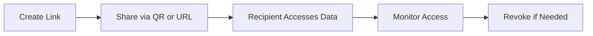
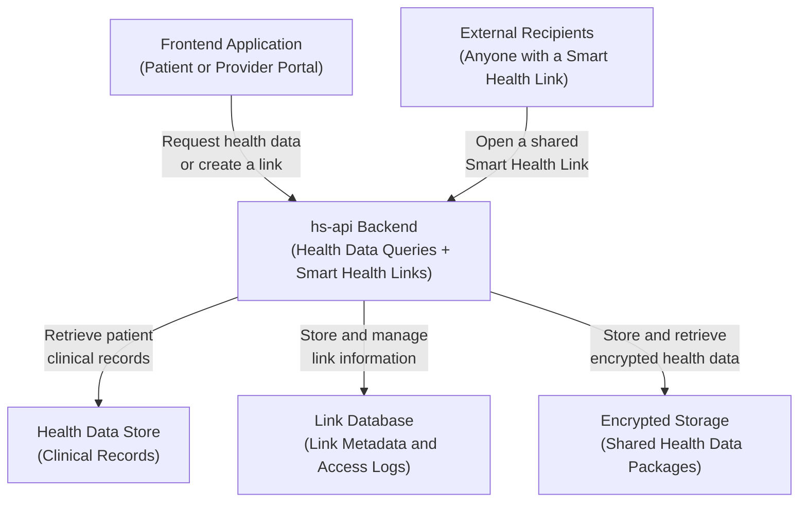

# hs-api Product Overview

## What is hs-api?

hs-api is a backend service that enables patients and healthcare providers to securely
access and share patient health data. It is designed around two primary functions:

1. **Health Data Queries** -- Retrieve a patient's clinical information across ten
   medical data types, plus basic demographics.

2. **Smart Health Links** -- Create secure, time-limited, shareable links to a
   patient's health information that can be sent to anyone who needs it.

Together, these capabilities allow a patient or their care team to pull together a
comprehensive health summary and share it safely with specialists, family members,
insurers, or anyone else involved in the patient's care.

---

## Core Capabilities

### Health Data Access

hs-api can retrieve eleven categories of patient health information from a connected
health data store. Each category is described below in plain language.

- **Patient Demographics** -- The patient's basic identifying information: name,
  date of birth, gender, address, phone number, and email.

- **Medications** -- Current and past prescriptions, including drug names, dosages,
  how often they should be taken, and whether each prescription is still active.

- **Immunizations** -- A record of vaccines the patient has received, including the
  vaccine name, the date it was administered, and where on the body it was given.

- **Allergies** -- Known allergic reactions, including the substance that triggers
  the allergy, how severe it is, and what symptoms it causes.

- **Conditions** -- Medical diagnoses the patient has received, along with whether
  each condition is active or resolved, and when it was first identified.

- **Procedures** -- Medical procedures the patient has undergone, including the
  procedure name, when it was performed, and where it took place.

- **Lab Results** -- Results from blood tests, urine tests, and other laboratory
  work, including the measured value and the normal reference range for comparison.

- **Insurance Coverage** -- The patient's health insurance plans, including the
  plan type, the insurance company, the subscriber identification number, and
  whether the coverage is currently active.

- **Claims** -- Medical billing records, including which provider submitted the
  claim, the services billed, and the amounts charged.

- **Appointments** -- Scheduled medical visits, including the appointment date and
  time, the type of visit, and the providers or staff involved.

- **Care Teams** -- The healthcare providers involved in the patient's care,
  including each provider's name, role (such as primary care physician or
  specialist), and the category of care they provide.

### Smart Health Links

Smart Health Links allow a patient or provider to bundle selected health data into a
secure, shareable link. The key features of Smart Health Links are:

- **Selective sharing** -- Choose exactly which of the eleven data types to include
  in the link. Share only what is relevant.

- **Two sharing modes** -- Links can operate in Snapshot mode (a frozen copy of
  the data) or Live mode (always shows the latest information). See the Sharing
  Modes section below for details.

- **Encryption** -- All health data within a link is encrypted. Only someone who
  has the link can view the data.

- **Time limits** -- Every link has an expiration date. Once expired, the link
  stops working. Expiration periods range from as short as five minutes to as
  long as one year.

- **Revocable** -- The person who created the link can disable it at any time,
  immediately blocking all future access.

- **QR code support** -- Each link can be represented as a QR code, making it easy
  to share in person by scanning with a phone camera.

- **PDF summary** -- Optionally generate a printable PDF document summarizing the
  patient's health data for situations where a paper copy is needed.

---

## Smart Health Link Lifecycle

A Smart Health Link follows a clear five-stage lifecycle from creation through
optional revocation.

### Stage 1: Create

The process begins when a patient or provider creates a new Smart Health Link. During
creation, they make three decisions:

- **What to include** -- Select which health data types (medications, lab results,
  allergies, and so on) the link should contain.
- **When it expires** -- Set an expiration date after which the link will no longer
  work.
- **Snapshot or Live** -- Choose whether the link should contain a frozen copy of
  the data taken at this moment, or whether it should pull fresh data every time
  someone opens it.

### Stage 2: Share

Once the link is created, it can be shared in two ways:

- **As a URL** -- A web address that can be sent by email, text message, or any
  other communication channel.
- **As a QR code** -- A scannable image that encodes the same link, convenient for
  sharing during in-person visits.

### Stage 3: Access

When a recipient opens the link, they see the patient's health data. If the link is
in Snapshot mode, they see the data as it existed when the link was created. If it is
in Live mode, the system retrieves the patient's current data before displaying it.

### Stage 4: Monitor

Every time someone accesses a link, the system records the event. The link creator
can review an access log that shows:

- When the link was accessed.
- How many times it has been accessed.

This audit trail provides visibility into how the shared health data is being used.

### Stage 5: Revoke (Optional)

At any point, the link creator can revoke the link. Revocation is immediate -- once
a link is revoked, anyone who tries to open it will be denied access. This is useful
if the link was shared with the wrong person, if the care episode has ended, or if
the patient simply changes their mind about sharing.

---

## Data Types at a Glance

The following table summarizes each data type in plain language, with an example of
what a typical entry might look like.

| Data Type | What It Contains | Example |
|---|---|---|
| Demographics | Patient's basic information | Name, date of birth, gender, address, phone, email |
| Medications | Current and past prescriptions | Metformin 500mg twice daily for diabetes |
| Immunizations | Vaccination records | COVID-19 vaccine, January 2024, left arm |
| Allergies | Known allergic reactions | Penicillin allergy -- severe, causes hives |
| Conditions | Medical diagnoses | Type 2 Diabetes, diagnosed March 2020 |
| Procedures | Medical procedures performed | Knee arthroscopy, June 2023 |
| Lab Results | Blood tests and other lab work | Blood glucose: 95 mg/dL (normal range: 70-100) |
| Insurance | Health insurance coverage | Blue Cross PPO, active since January 2024 |
| Claims | Medical billing information | Office visit, Dr. Smith, $150 |
| Appointments | Scheduled medical visits | Annual physical, March 15, 2026 |
| Care Teams | Healthcare providers | Primary care physician, cardiologist |

---

## Sharing Modes

Smart Health Links support two distinct sharing modes, each suited to different
situations.

### Snapshot Mode

In Snapshot mode, the system captures a complete copy of the selected health data at
the moment the link is created. That copy is then frozen -- it will never change, no
matter how many times the link is opened or how much time passes.

**How it works:**

- When the link is created, the system reads the patient's current health data,
  packages it, encrypts it, and stores it.
- Every time someone opens the link, they see that same stored copy.
- Even if the patient's health data changes after the link was created, the link
  continues to show the original data.

**Best for:**

- Sharing a point-in-time health summary before a specialist appointment.
- Providing a discharge summary after a hospital stay.
- Sending a vaccination record for school or travel requirements.
- Any situation where you want to share "what the data looked like on this date."

### Live Mode

In Live mode, the system retrieves the patient's latest health data every time
someone opens the link. The link never contains stale information.

**How it works:**

- When the link is created, no health data is stored. Instead, the system saves
  instructions about which data types to retrieve and for which patient.
- Every time someone opens the link, the system queries the health data store for
  the patient's current information, packages it, and returns it.
- If the patient's medications, lab results, or other data have changed since the
  last access, the new data will be reflected.

**Best for:**

- Ongoing care coordination where multiple providers need the latest information.
- Chronic disease management where lab results and medications change frequently.
- Any situation where the recipient should always see the most current data.

---

## Security Model

hs-api is designed to protect patient health data at every stage. Here is how the
system keeps shared data safe, explained without technical jargon.

### Encrypted

All health data shared through a Smart Health Link is encrypted -- scrambled into a
form that is unreadable without the right key. The key is embedded in the link
itself, so only someone who has the link can unscramble and read the data. The data
is encrypted before it is stored, and it remains encrypted until the moment a
recipient opens the link.

### Time-Limited

Every Smart Health Link has a built-in expiration date chosen by the person who
creates it. Expiration periods can be set from as short as five minutes to as long as
one year. Once a link expires, it stops working entirely. No one can access the data
through an expired link, even if they saved the link previously.

### Revocable

The person who created a link can disable it at any time, with immediate effect.
Once revoked, the link is permanently deactivated. This provides a safety net -- if a
link is shared with the wrong person, or if circumstances change, access can be cut
off instantly.

### Audited

Every time someone accesses a Smart Health Link, the system records the event. The
link creator can review this access log to see when the link was used and how many
times it has been opened. This audit trail helps ensure accountability and provides
peace of mind that the data is being accessed as expected.

### No Passwords Required

Smart Health Links do not require the recipient to create an account or remember a
password. The link itself serves as the access credential, similar to a sealed
envelope -- whoever has the envelope can open it. This design makes sharing
frictionless while still maintaining security through encryption and time limits.

### Defense in Depth

The system uses multiple overlapping layers of protection. Encryption protects the
data contents. Time limits reduce the window of exposure. Revocation provides an
emergency shutoff. Access logging enables monitoring. Even if one protective layer
were somehow bypassed, the remaining layers continue to guard the data.

---

## Compliance and Standards

hs-api is built on widely recognized healthcare data and sharing standards.

- **HL7 FHIR R4** -- The system stores and exchanges health data using FHIR
  (Fast Healthcare Interoperability Resources), Release 4. FHIR is an
  internationally recognized standard for representing and exchanging healthcare
  information, maintained by Health Level Seven International (HL7). It defines
  a common format for health data so that different systems can understand each
  other.

- **SMART Health Links Protocol** -- The link sharing mechanism follows the SMART
  Health Links specification, an open standard for creating secure, shareable
  links to health data. This ensures that links created by hs-api are compatible
  with other systems that support the same protocol.

- **Patient Shared Health Document (PSHD) Profile** -- The system implements the
  PSHD profile, which defines a standardized structure for organizing a patient's
  health summary into a single shareable document.

- **Accessible PDF Generation** -- When generating PDF summaries of patient health
  data, the system produces documents that meet accessibility standards. This
  means the PDFs are compatible with screen readers and other assistive
  technologies, ensuring that people with visual impairments can access the
  information.

---

## Current Limitations

While hs-api provides a robust set of health data sharing capabilities, there are
several limitations to be aware of.

- **Health data store required** -- hs-api does not store clinical data itself. It
  requires a connection to an external health data system (specifically, AWS
  HealthLake) to retrieve patient records. Without this connection, the health
  data query and live link features will not function.

- **Identity mapping required** -- Before hs-api can retrieve data for a patient,
  that patient must have an identity mapping configured in the system. This
  mapping connects the patient's identity in hs-api to their record in the
  health data store. Until this mapping is established, no clinical data can be
  accessed for that patient.

- **PDF scope** -- The PDF generation feature produces a basic patient health
  summary. It includes the most commonly needed data types but does not cover
  every possible detail in the patient's full health record.

---

## High-Level System Diagram

The following diagram shows the major components of the system and how they
interact. Each box represents a distinct part of the system, and each arrow
shows the direction of communication.

**How the components work together:**

- **Frontend Application** -- A patient portal or provider application where users
  log in, view health data, and create or manage Smart Health Links. This is a
  separate application that communicates with hs-api.

- **hs-api Backend** -- The central service described in this document. It handles
  all requests: querying health data, creating links, serving shared data to
  recipients, and enforcing security rules.

- **Health Data Store** -- The external system where patient clinical records are
  stored (such as medications, lab results, immunizations, and other medical
  data). hs-api reads from this store but does not modify it.

- **Link Database** -- Where hs-api keeps track of all Smart Health Links that have
  been created, including their settings (expiration, sharing mode, included data
  types) and access logs (who opened them and when).

- **Encrypted Storage** -- Where encrypted health data packages are stored for
  Snapshot mode links. When a Snapshot link is created, the patient's data is
  encrypted and placed here. When someone opens the link, the encrypted package
  is retrieved from here and decrypted.

- **External Recipients** -- Anyone who has received a Smart Health Link, whether
  by QR code, email, text message, or any other channel. They do not need an
  account -- they simply open the link to view the shared data.

---

## Summary

hs-api provides a secure, standards-based way to access and share patient health
data. It supports eleven categories of clinical information, two flexible sharing
modes, and a robust security model built on encryption, time limits, revocation, and
access monitoring. Smart Health Links make it easy to share exactly the right health
information with exactly the right people, for exactly as long as needed.
